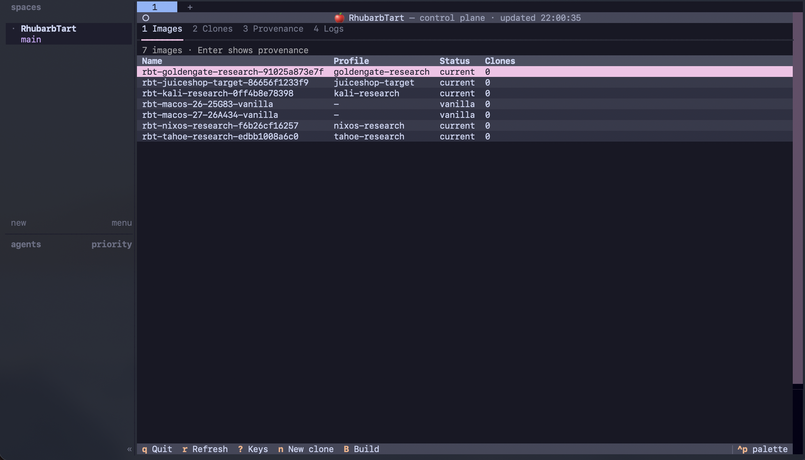
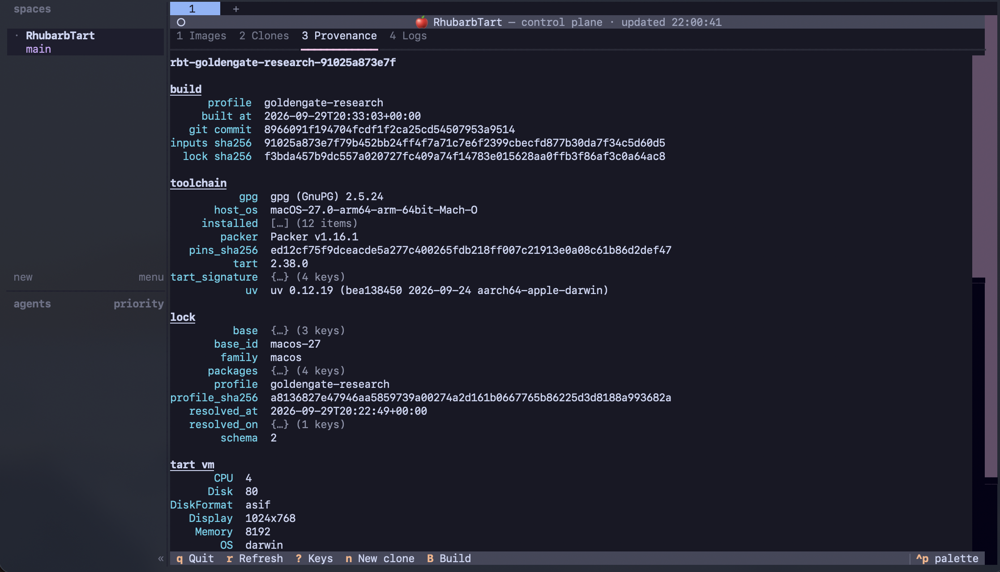

<div align="center">

# 🍎 RhubarbTart

**Security-research VMs for Apple silicon, built from verified vendor installers.**



<br/><sub>The <code>./rhubarbtart-tui</code> dashboard, running inside <a href="https://herdr.dev">herdr</a>.</sub>

</div>

---

Describe a guest in a short JSON profile: an OS (macOS 26 or 27, NixOS or Kali) and the tools
you need. RhubarbTart downloads the vendor installers and checks each one against a pinned hash
and, where one exists, the vendor's signature. It then builds a hardened [Tart](https://tart.run)
VM image from them and tests a temporary copy from outside the VM. You work in disposable clones
of the image, each with its own password, and delete them when you're done. In an engagement, the
commands you run and the files you collect are kept as evidence on your Mac. You can seal that
evidence into a signed vault to hand over.

Use it for security work where you need to know what was on the machine. Examples are testing
macOS and iOS apps, analysing malware, client engagements, and AI agents working on scoped
research under [herdr](https://herdr.dev). [What it's for](#what-its-for) describes each use.

## Why RhubarbTart

Research VMs are often built from a snapshot someone else made, then changed over time. After a
while it's hard to say what software the machine contained. It's also hard to reproduce a result
on the same setup, or to be sure that nothing from one job carried over into the next.

RhubarbTart is built to answer those questions:

| | |
|---|---|
| **Verified inputs** | Each guest starts from the OS vendor's own installer. Every download is pinned by its hash, checked against the vendor's signature where one exists, and checked again inside the guest before it's installed |
| **Tested before use** | A new image only gets its final name after a temporary copy of it passes a set of security checks run from outside the VM |
| **Hardened defaults** | No default passwords, no automatic login, no password-free `sudo` for users ([one narrow Kali exception](docs/trust-model.md#security-posture)), SSH by key only or not at all, firewall on, and no machine or VPN identity shared between copies |
| **Secrets on the host** | Passwords are stored in your macOS keychain. Every copy gets its own password, and VPN sign-in happens per copy, never inside the image |
| **Evidence you can hand over** | In an engagement, the commands run through `rhubarbtart exec` and the files collected from clones are kept on your Mac in a hash-chained journal. Seal it into a signed vault that can be checked offline on any machine ([Engagements](docs/using.md#engagements)) |
| **Configured in JSON** | A guest is defined by a short profile: an OS, a list of tools and a few options |


<sub>Every image records what went into it. The dashboard's Provenance tab shows the build commit,
the input and lock hashes, the pinned toolchain and the locked base.</sub>

## How it fits together

There are four main parts:

> **Profile** → **Lock** → **Image** → **Clone**

1. A **profile** describes the guest you want: an OS and a list of tools.
2. **Resolving** the profile produces a **lock** file. It lists the exact version, download URL
   and hash of every **input** (each installer and package). You review the lock and commit it,
   like code.
3. **Building** installs everything the lock lists into a hardened **image**. The image is tested
   from the outside, then kept as a template and never started.
4. You **work in a clone** of the image: a disposable copy with its own password. When you're
   done, delete the clone. The next clone starts from the same state.

An image's name comes from its inputs (`rbt-<profile>-<hash>`), so the same lock always gives
the same image name. The build saves a record of what went into each image in
`out/<image>.provenance.json`.

> [!TIP]
> New to the terms? **[Key concepts](docs/concepts.md)** explains each one, including the build
> steps (vanilla VM, seal, smoke test, provenance) and optional features such as **stacked
> clones**.

## What it's for

Each use follows the same steps: build a hardened guest with known contents, work in a
**disposable clone**, and delete the clone afterwards.

<details>
<summary><b>macOS and iOS app testing</b></summary>

Testing a macOS app, an iOS app and its backend, or an Apple service needs a clean Apple
environment, set up the same way each time. RhubarbTart builds a hardened **macOS**
guest with your tools (Chrome, ZAP, a VPN or ZTNA client) pinned and verified. Each image's
contents are recorded, and each clone is separate and disposable. So you can state what the
machine contained, repeat a test from the same starting point, and keep one client's data out of
the next engagement.

The macOS guest is a workstation for Apple work, such as simulators, intercepting proxies and
analysis tools. It isn't an iOS VM: Tart runs macOS and Linux guests.

Why Apple app testing is hard, and what each part of the tool does about it:
[Testing macOS and iOS apps](docs/testing-apple-apps.md).

</details>

<details>
<summary><b>Disposable machines for research and malware analysis</b></summary>

Running a malware sample or examining something hostile calls for a machine you can trust before
the run and throw away after it. Clone the image, do the work in the clone, then delete it. The
image itself is never started, so it can't be infected, and the next analysis starts from the same
clean state. Because the image's contents are recorded, anything you find that wasn't in the
image came from the sample, not from leftover tools.

NixOS and Kali give you a fully pinned Linux machine for analysis. macOS guests let you study
Mac malware on the platform it targets. Clones can't reach each other. An engagement can open an
explicit link between two of them, and a lab target like Juice Shop has no route out
([Engagements](docs/using.md#engagements)).

</details>

<details>
<summary><b>Agent-driven engagements with herdr</b></summary>

RhubarbTart can run AI agents for scoped research, penetration tests and CTFs inside these VMs.
The agents run under [herdr](https://herdr.dev), a terminal workspace manager for AI coding
agents. Evidence stays on the host, outside the VMs. You can:

- create and remove a whole set of clones for one scope as an
  [engagement](docs/using.md#engagements);
- record the commands run in its clones and the files they produce as hash-chained evidence, and
  seal that evidence into a signed, portable vault;
- start the engagement's agents under herdr with `rhubarbtart herdr arm`. Each agent reaches only
  its assigned clone, through the `rbt-range` client. Commands that match a configured pattern
  wait for your approval.

Not built yet: enforcing an engagement's agent budget, recording the agents' prompts and replies,
and running each engagement's agents in their own VM instead of on your Mac. The
[herdr charter](docs/HERDR-CHARTER.md) sets the boundary for this work, and
[`docs/PLAN.md`](docs/PLAN.md) has the design and roadmap.

</details>

## Quick start

On an Apple silicon Mac running macOS 26 or later:

```sh
# 1. Install the pinned tools into ./.toolchain (no Homebrew, no sudo)
./tools/bootstrap.sh && source scripts/env.sh && uv run tools/resolve.py preflight

# 2. Resolve a guest's inputs into its lock file, then review the changes
uv run tools/resolve.py resolve kali-research && git diff locks/

# 3. Build and test the image (the SSH key is optional; without one, SSH is disabled)
ssh-add ~/.ssh/id_ed25519
RHUBARB_SSH_PUBKEYS=~/.ssh/id_ed25519.pub ./scripts/build.sh kali-research

# 4. Make a clone and start it; don't use the image directly
./rhubarbtart new web-1 --profile kali-research && ./rhubarbtart run web-1
```

<details>
<summary><b>What each step does</b></summary>

1. **Bootstrap** downloads Tart, Packer and its Tart plugin, uv, zot and cosign, and builds GnuPG
   from source. Each is checked against a pinned hash and installed into the repository's own
   `.toolchain/` folder. `preflight` then confirms that these are the versions on your `PATH`.
   Building GnuPG needs the Xcode Command Line Tools.
2. **Resolve** looks up the newest versions of the profile's inputs, verifies them, and writes
   `locks/kali-research.lock.json`. The included profiles already have committed locks, so you
   only need this step when you want newer versions.
3. **Build** installs the OS from the vendor's installer, adds the tools, and **seals** the guest:
   it applies the hardening and checks that each setting took effect. It then starts a temporary
   copy and tests it from the outside. Only if those tests pass does the image get its final name.
   A build is a full OS install and can take 15 to 45 minutes, so run it in a separate terminal.
   `./scripts/build.sh --list` lists the available profiles.
4. **`rhubarbtart new`** creates a clone and gives it its own password, stored in your keychain.
   `rhubarbtart run` starts it. [Using your VMs](docs/using.md) covers `ssh`, `enroll`, `reset`,
   `rm`, engagements and the dashboard.

</details>

`./rhubarbtart-tui` gives the same actions in a keyboard-driven dashboard, with tabs for images,
clones, provenance and logs. Inside herdr it uses herdr's colour theme.

## Choose a guest

| Profile | OS | Tools | Suited to |
|---|---|---|---|
| `tahoe-research` | macOS 26 | Chrome, ZAP, WARP, Tailscale | macOS app and client testing on any macOS 26 or newer host |
| `goldengate-research` | macOS 27 | Chrome, ZAP, WARP, Tailscale | The current macOS release; **needs a macOS 27 host** |
| `nixos-research` | NixOS 26.05 | Chrome, ZAP, WARP, Tailscale · XFCE · Rosetta | The most reproducible option: the whole OS is pinned to a single commit |
| `kali-research` | Kali rolling | Chrome, ZAP, WARP, Tailscale · `kali-linux-default` · XFCE · Rosetta | Kali's standard set of security tools |

All guests are arm64, because Tart runs native guests on Apple silicon. Linux profiles with
Rosetta enabled can still run x86_64 Linux programs. If none of these fit, you can
[define your own guest](docs/profiles.md).

A fifth profile, `juiceshop-target`, is a lab target rather than a workstation: a NixOS guest that
runs OWASP Juice Shop on port 3000 with no route out. The `juiceshop-lab` engagement pairs it with
a Kali attacker ([Engagements](docs/using.md#engagements)).

<details>
<summary><b>Which one should I pick?</b></summary>


</details>

## Documentation

The [documentation index](docs/README.md) lists every page: guides, reference pages and the
design records. If you're new, start with [Key concepts](docs/concepts.md), then
[Using your VMs](docs/using.md).

Contributing: [`CONTRIBUTING.md`](CONTRIBUTING.md). Reporting security issues:
[`SECURITY.md`](SECURITY.md).

## Open issues

Open bugs, enhancements and the roadmap are in the
[issue tracker](https://github.com/errantpacket/RhubarbTart/issues).

## License

RhubarbTart is licensed under the [Functional Source License 1.1, Apache-2.0 future
license](LICENSE.md) (`FSL-1.1-ALv2`). You may use it for any purpose except building a competing
commercial product. Each release becomes Apache-2.0 two years after it is published. Third-party
components keep their own licenses, listed in [`THIRD-PARTY-NOTICES.md`](THIRD-PARTY-NOTICES.md).

---

<div align="center">
<sub>Setup Assistant automation adapted from <a href="https://github.com/cirruslabs/macos-image-templates">cirruslabs/macos-image-templates</a> ·
VMs run on <a href="https://tart.run">Tart</a> · agents run under <a href="https://herdr.dev">herdr</a> ·
built with Packer, uv and Nix.</sub>
</div>
