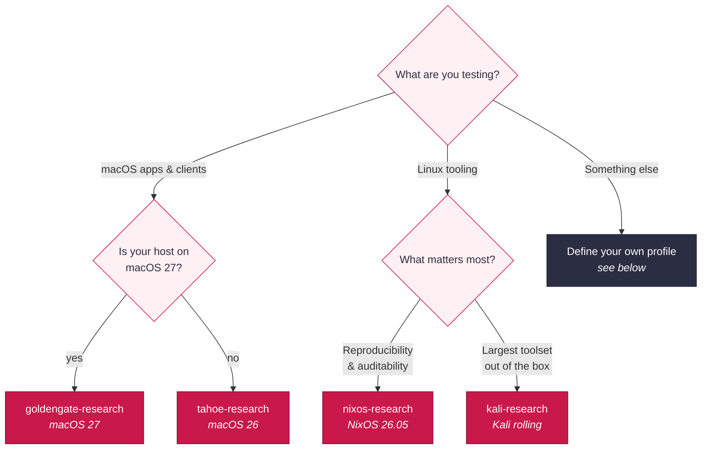
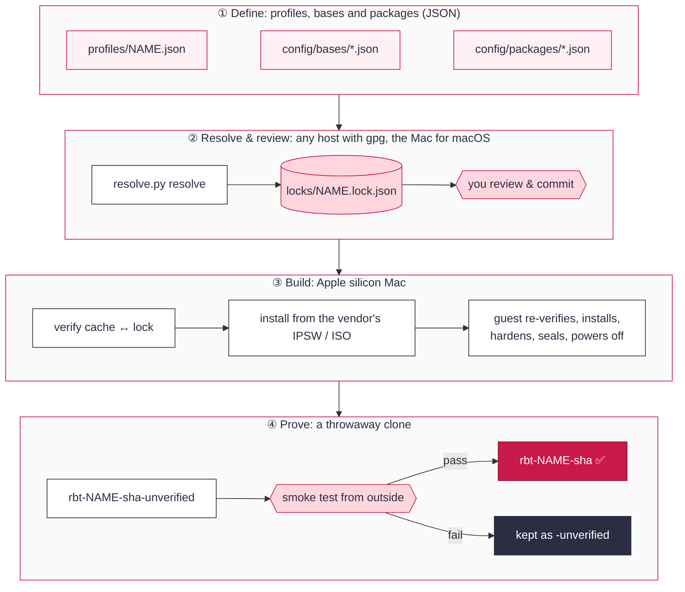
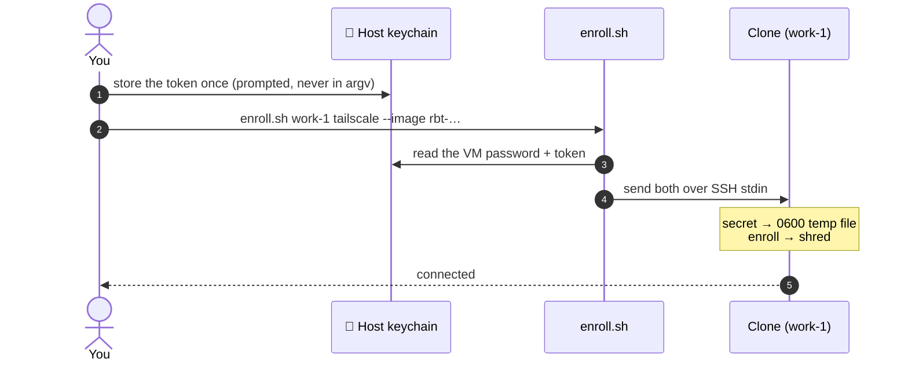
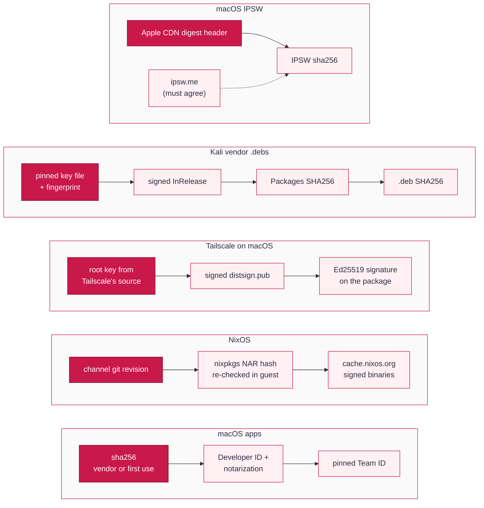
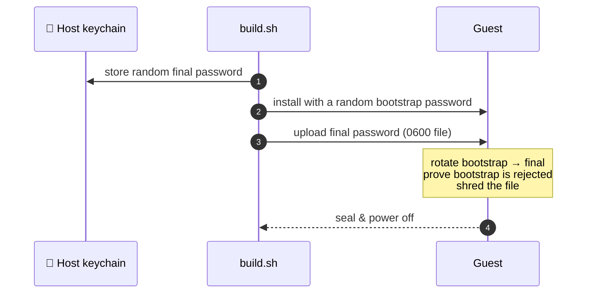

<div align="center">

# 🍓 RhubarbTart

**Provenance-first, hardened security-research VMs for Apple silicon.**
<br/>Pick a profile, get a sealed [Tart](https://tart.run) guest whose every input is pinned, verified
and proven.


</div>

---

## Why RhubarbTart

Research VMs usually start from someone else's image and drift from there. RhubarbTart starts every
guest from the **OS vendor's own installer**, pins **every** input in a reviewed lock file, verifies
each one **twice** (on the host and again inside the guest), and refuses to name an image until a
throwaway clone has **proven** its hardening from the outside.

| | |
|---|---|
| 🧾 **Known inputs** | Apple IPSW, NixOS/Kali ISOs, apps and host tools are pinned by hash, checked against vendor signatures where they exist, and locked per guest |
| 🧱 **Hardened by default** | No default passwords, no auto-login, no passwordless sudo, key-only SSH (or none), firewall on, no shared machine or VPN identity |
| 🔬 **Proven, not assumed** | Every image is smoke-tested from outside on a disposable clone before it gets its final name |
| 🧩 **Configurable** | A guest is a small JSON profile: OS base + tools + options. No code needed for new guests |
| 🔐 **Secrets stay yours** | Passwords live in your macOS keychain; VPN enrollment happens per clone, at runtime, never baked in |

## Contents

- [Quick start](#quick-start)
- [Choose a guest](#choose-a-guest)
- [How it works](#how-it-works)
- [Using your VMs](#using-your-vms)
- [Define your own guest](#define-your-own-guest)
- [Trust model](#trust-model)
- [Security posture](#security-posture)
- [Keeping inputs fresh](#keeping-inputs-fresh)
- [Reference](#reference): configuration, toolchain, repository map
- [Development](#development)
- [Known gaps](#known-gaps)

## Quick start

On an Apple silicon Mac (macOS 26 or later):

```sh
# 1. Install the pinned toolchain (Tart, Packer, plugin, uv) into ./.toolchain. No Homebrew, no sudo.
./tools/bootstrap.sh && source scripts/env.sh && uv run tools/resolve.py preflight

# 2. Resolve a guest's inputs into a lock file, then review and commit it.
uv run tools/resolve.py resolve kali-research && git diff locks/

# 3. Build: install, harden, seal, smoke-test. SSH keys are optional (no keys = no SSH).
ssh-add ~/.ssh/id_ed25519
RHUBARB_SSH_PUBKEYS=~/.ssh/id_ed25519.pub ./scripts/build.sh kali-research

# 4. Work in clones, never in the built image.
tart clone rbt-kali-research-<sha> work-1 && tart run --rosetta=rosetta work-1
```

> [!TIP]
> `./scripts/build.sh --list` shows every profile. Builds are long (a full OS install), so run
> them in a spare terminal.

## Choose a guest

| Profile | Base | Tools | Good for |
|---|---|---|---|
| `tahoe-research` | macOS 26 | Chrome, ZAP, WARP, Tailscale, Perimeter 81 | macOS client and app testing on any macOS 26+ host |
| `goldengate-research` | macOS 27 | Chrome, ZAP, WARP, Tailscale, Perimeter 81 | The latest macOS; **needs a macOS 27 host** |
| `nixos-research` | NixOS 26.05 | Chrome, ZAP, WARP, Tailscale · XFCE · Rosetta | Maximum reproducibility: the whole OS is pinned to one commit |
| `kali-research` | Kali rolling | Chrome, ZAP, WARP, Tailscale · `kali-linux-default` · XFCE · Rosetta | Batteries-included offensive tooling |



> [!NOTE]
> Guests are arm64 only (Tart runs native guests on Apple silicon). Linux profiles with
> `"rosetta": true` can still run x86_64 Linux binaries through Apple's Rosetta.

## How it works



1. **Define.** A profile names an OS base and a list of tools. Bases and packages declare
   *where* each input comes from and *how* it is verified.
2. **Resolve.** `resolve.py` finds the current versions, downloads them, verifies them, and
   writes a lock. macOS profiles resolve on the Mac; NixOS and Kali resolve anywhere with `gpg`.
   **A human reviews the lock diff before it's committed.**
3. **Build.** `build.sh` re-checks the cache against the lock and installs from the vendor
   image. Inside the guest, every staged file is checked again before install. The guest then
   hardens itself, removes build residue and identity, and powers off.
4. **Prove.** A disposable clone boots and is attacked politely from outside: password login
   must be refused, key login must work, and no auto-login, passwordless sudo or open Screen
   Sharing is allowed. Only then is the image renamed to `rbt-<profile>-<inputs-sha>`. The name
   is derived from the inputs, so identical inputs give an identical name, and
   `out/<vm>.provenance.json` records exactly what went in.

## Using your VMs

```sh
tart clone rbt-<profile>-<sha> work-1           # always clone; keep the built image pristine
tart run work-1                                 # macOS guests
tart run --rosetta=rosetta work-1               # Linux guests with "rosetta": true
./scripts/ssh.sh work-1                         # key-only SSH; host key pinned per VM name
security find-generic-password -s RhubarbTart -a rbt-<profile>-<sha> -w   # login/sudo password
```

### VPN and ZTNA enrollment

Images never contain VPN identity. Each clone is enrolled at runtime, and the secrets never
touch the repo, a profile, the image, or a command line:



| Service | Command | Secret (keychain service `RhubarbTart-enroll`) | Notes |
|---|---|---|---|
| Tailscale | `enroll.sh work-1 tailscale --image rbt-…` | account `tailscale-authkey` | Use a one-off, pre-approved, *tagged* key (ephemeral for throwaway clones). macOS: approve the system extension once per clone |
| Cloudflare WARP | `enroll.sh work-1 warp --org TEAM --image rbt-…` | `warp-client-id`, `warp-client-secret` | A service token allowed to enroll devices; dashboard version pushes are disabled |
| Perimeter 81 | `enroll.sh work-1 perimeter81` | — | Prints the manual sign-in and extension-approval steps |

Store a secret with `security add-generic-password -s RhubarbTart-enroll -a tailscale-authkey -w`
(it prompts). `--image` tells `enroll.sh` which built image's keychain password the clone
inherited.

## Define your own guest

A profile is a small JSON file in `profiles/`:

```json
{
  "id": "kali-web",
  "description": "Kali for web-app testing",
  "base": "kali-rolling",
  "packages": ["chrome", "zap"],
  "username": "admin",
  "vm": { "cpu": 6, "memory_gb": 12, "disk_gb": 100 },
  "options": { "desktop": "xfce", "rosetta": false, "kali_metapackages": ["kali-linux-headless"] }
}
```

<table>
<tr><th>Tool</th><th>macOS</th><th>NixOS</th><th>Kali</th></tr>
<tr><td><code>chrome</code></td><td>✅</td><td>✅</td><td>✅</td></tr>
<tr><td><code>zap</code></td><td>✅</td><td>✅</td><td>✅ (Kali archive)</td></tr>
<tr><td><code>warp</code></td><td>✅</td><td>✅</td><td>✅</td></tr>
<tr><td><code>tailscale</code></td><td>✅</td><td>✅</td><td>✅</td></tr>
<tr><td><code>perimeter81</code></td><td>✅ tenant pkg</td><td>—</td><td>—</td></tr>
</table>

| Key | Rule |
|---|---|
| `id` | Equals the filename; lowercase letters, digits, dashes |
| `base` | `macos-26`, `macos-27`, `nixos-26.05`, `kali-rolling` (files in `config/bases/`) |
| `packages` | Tools from the catalog above; each must support the base's OS |
| `username` | 3–16 lowercase letters/digits (default `admin`) |
| `vm` | `cpu` 2–64, `memory_gb` 4–256, `disk_gb` 40–2048 (defaults come from the base) |
| `options.desktop` | NixOS/Kali: `"none"` or `"xfce"` |
| `options.rosetta` | NixOS/Kali: run x86_64 binaries (start clones with `--rosetta=rosetta`) |
| `options.kali_metapackages` | Kali: e.g. `kali-linux-default`, `kali-linux-headless` |

Validation is strict. Unknown keys, options for the wrong OS, bad values or unsupported tools are
rejected, so a typo can never silently build a different image. Check with
`uv run tools/resolve.py list`. Editing a profile changes its identity, so re-resolve its lock.
Adding a tool that *isn't* in the catalog requires a trustworthy source first; see
[Keeping inputs fresh](#keeping-inputs-fresh).

> [!IMPORTANT]
> Perimeter 81 has no public, versioned download. Save your tenant installer from the Harmony
> SASE portal (Devices → Downloads → Agents) as exactly `vendor/perimeter81/Perimeter81.pkg`.
> An image containing it is tenant-specific, so share it only through a private registry.

## Trust model

Each kind of input has its own chain of trust. The lock records which chain produced every hash
(`hash_sources`), so reviewers can see where trust comes from.



<details>
<summary><b>Full provenance table</b> (every input, its anchor and its signer)</summary>

| Input | Source | Hash anchor | Signature / signer |
|---|---|---|---|
| Host toolchain | Upstream releases | `config/toolchain.env` | See [Toolchain](#toolchain) |
| macOS IPSW | `updates.cdn-apple.com` only | Apple CDN `x-amz-meta-digest-sha256`, cross-checked with ipsw.me | Apple-signed components, enforced by the VM boot chain |
| NixOS ISO | `releases.nixos.org` (versioned) | Published `.sha256` over HTTPS | — (installer only) |
| nixpkgs (whole OS) | GitHub archive of the channel's `git-revision` | sha256 + **NAR hash** (pure-Python, matches Nix), re-verified by Nix in the guest | Binaries: `cache.nixos.org` signature (`require-sigs`) |
| Kali ISO | `cdimage.kali.org/kali-<ver>/` | `SHA256SUMS` | GPG, Kali key `827C 8569 … C8D5 E4C5` |
| Kali vendor `.deb`s | Google / Cloudflare / Tailscale apt repos | `Packages` SHA256 from the signed `InRelease` | GPG: Google `EB4C…4796`, Cloudflare `C068…C3BA`, Tailscale `2596…5868` |
| Kali distro packages | Kali archive | apt | Kali archive key; installed versions recorded in the image |
| NixOS packages | nixpkgs at the pinned rev | Fixed-output hashes in nixpkgs | nixpkgs maintainers + cache signature |
| Chrome (macOS) | Enterprise pkg (unversioned URL) | First use | Developer ID + notarized, Team `EQHXZ8M8AV` |
| ZAP (macOS) | GitHub release | GitHub asset digest | Notarized; pin the Team ID after the first resolve |
| WARP (macOS) | Versioned pkg from Cloudflare's feed | First use (no vendor hash exists) | Developer ID + notarized, Team `68WVV388M8` |
| Tailscale (macOS) | `pkgs.tailscale.com` | Vendor `.sha256` | **distsign** Ed25519 chain from a pinned root, plus Team `W5364U7YZB` |
| Perimeter 81 (macOS) | Your tenant portal | First use | Developer ID + notarized; pin the Team ID after the first resolve |

</details>

**What "pinned" means per family.** NixOS is the strongest: one commit plus a NAR hash defines
the whole OS. macOS and Kali pin the OS image and every vendor tool. Kali is a rolling release,
though, so packages from the Kali archive (such as `zaproxy` and the metapackages) are "signed
and current at build time", and their exact versions are recorded in
`/var/lib/rhubarbtart/installed.txt`. "Reproducible" means identical inputs and process, not
identical disk bytes; machine identifiers and timestamps always differ.

## Security posture

| | macOS | NixOS | Kali |
|---|---|---|---|
| **Password** | Random per build, host keychain only | same | same |
| **How it gets there** | Typed over VNC (26); bootstrap → rotate → proven dead (27) | yescrypt hash from a 0600 upload, outside the Nix store | Bootstrap → `chpasswd` from stdin |
| **Login** | No auto-login | No auto-login | No auto-login |
| **sudo** | Password required; no `NOPASSWD` | Password required; `execWheelOnly` | Password required; `kali-grant-root` refused |
| **SSH** | Key-only, `from=` host, no forwarding; off without keys | same, declared in Nix | same |
| **Identity** | Host keys wiped, regenerated per clone | Never generated in the image | Host keys + machine-id wiped, regenerated per clone |
| **Firewall** | Application firewall + stealth | NixOS firewall | nftables inbound default-deny |
| **Integrity** | SIP + Gatekeeper on | Signed binary cache only | Signed Kali archive only |
| **VPN identity** | Wiped; enrolled per clone | Not created; enrolled per clone | Stopped + wiped; enrolled per clone |

Every row is asserted during the build's seal step (or declared in `nix/`), and every observable
row is re-checked from outside by `scripts/smoke-test.sh`.

Where a tool forces a password onto a command line (Apple's provisioning API, the Kali
installer), RhubarbTart uses a throwaway **bootstrap** password and rotates it away:



## Keeping inputs fresh

```sh
uv run tools/resolve.py plan kali-research       # what would change (no downloads)
uv run tools/resolve.py resolve kali-research    # re-pin; then review the diff and commit
uv run tools/resolve.py toolchain-pin --latest   # host tools; needs gpg, any OS
```

- **Review every lock diff.** Look for signer changes, URL hosts, TOFU entries and version jumps.
  The pin is only as good as the review.
- **"latest" is never trusted blindly.** Apple's "latest" IPSW is already macOS 27, so each macOS
  base filters on its major version. `pin_build` / `pin_version` in a base freezes it.
- **`team_id: null`** means "record and warn". Confirm the ID with the vendor, then pin it.
- **After a toolchain bump**, commit and re-run `./tools/bootstrap.sh` on the Mac.

## Reference

### Configuration

| Variable | Default | Effect |
|---|---|---|
| `RHUBARB_SSH_PUBKEYS` | unset | Public keys (ed25519/ecdsa, optionally `-sk`; RSA rejected) to authorize. Unset: SSH disabled |
| `RHUBARB_SSH_FROM` | `192.168.64.1` | `from=` restriction on those keys (Tart's host address); Kali's preseed server binds here too |
| `RHUBARB_USER` | `admin` | Username `ssh.sh` / `enroll.sh` connect as. Set it for profiles with a custom `username` |
| `REBUILD_VANILLA` | `0` | macOS: `1` reinstalls the vanilla VM from the IPSW and **rotates its password**. New macOS builds get a new vanilla VM automatically |
| `RHUBARB_CACHE` | `./cache` | Downloads (`artifacts/`) and per-profile guest stage dirs (`stage/`) |
| `GITHUB_TOKEN` | unset | Optional; avoids GitHub API rate limits while resolving |

### Requirements

<details>
<summary>Host, disk space, gpg and licensing (expand)</summary>

- An Apple silicon Mac on macOS 26 or later. macOS 27 guests need a **macOS 27 host**.
- About 100–150 GB free per built profile: OS images are 3–20 GB and VM disks 60–80 GB (sparse).
- `gpg` on whichever machine resolves NixOS/Kali profiles or runs `toolchain-pin`. Any OS works.
- Licensing: Tart 2.38.0 is FSL-1.1-ALv2 (© OpenAI), so check your use is a "Permitted Purpose".
  Chrome and WARP are proprietary; NixOS allows them only by name.

</details>

### Toolchain

<details>
<summary>Pinned, verified, repo-local; no Homebrew (expand)</summary>

`config/toolchain.env` pins the version, URL and SHA256 of each host tool, and
`tools/bootstrap.sh` installs them into the git-ignored `.toolchain/`:

| Tool | Release source | Pin accepted when… | Install-time checks |
|---|---|---|---|
| Tart | `github.com/openai/tart` | `tart_<v>_checksums.txt` == GitHub asset digest | sha256, codesign, notarization, `TART_TEAM_ID` |
| Packer | `releases.hashicorp.com` | `SHA256SUMS` GPG-verified against HashiCorp key `C874 011F … 72D7 468F` | sha256, Team ID if signed and pinned |
| packer-plugin-tart | `github.com/cirruslabs/packer-plugin-tart` | `SHA256SUMS` == GitHub asset digest | sha256; `packer plugins install --path` (never `packer init`) |
| uv | `github.com/astral-sh/uv` | `.sha256` == GitHub asset digest | sha256 |

- `scripts/env.sh` puts `.toolchain/bin` first on PATH, sets `PACKER_PLUGIN_PATH`, sets
  `CHECKPOINT_DISABLE=1` (no Packer phone-home), and pins uv to its own Python 3.13.
- `preflight` fails if a tool resolves outside `.toolchain/`, a version is off, or the pins
  changed since the last bootstrap.
- `toolchain-pin --latest` re-derives every hash and only accepts it when two upstream views
  agree.

</details>

### Repository map

<details>
<summary>What lives where (expand)</summary>

| Path | Purpose |
|---|---|
| `profiles/*.json` | What to build, one file per guest |
| `config/bases/*.json` · `config/packages/*.json` | OS installers and tools: where each comes from and how it is verified |
| `config/keys/` | Pinned vendor keys (HashiCorp, Google, Cloudflare, Tailscale, Kali) |
| `config/toolchain.env` | Host toolchain pins |
| `locks/*.lock.json` | Resolved inputs per profile (generated, reviewed, committed) |
| `tools/resolve.py` · `tools/rhubarb/` | `list` · `plan` · `resolve` · `verify` · `provenance` · `preflight` · `toolchain-pin` |
| `tools/bootstrap.sh` · `tools/check.sh` · `tools/test_rhubarb.py` | Toolchain install · static checks · offline crypto/parsing self-tests |
| `tools/serve_preseed.py` | One-shot preseed server bound only to Tart's host address |
| `packer/macos/` · `packer/linux/` | Build templates per family |
| `guest/macos/` · `guest/nixos/` · `guest/kali/` | In-guest verify/install and harden/seal scripts |
| `nix/` | The NixOS system definition (reads the staged profile) |
| `kali/preseed.cfg.tmpl` | Unattended Kali install (rendered per build, never committed rendered) |
| `scripts/` | `build.sh` · `smoke-test.sh` · `ssh.sh` · `enroll.sh` · `env.sh` · `publish.sh` (draft) |
| `.claude/skills/` | Guides for Claude Code sessions (see [Development](#development)) |

</details>

## Development

```sh
./tools/check.sh    # before every commit; also runs on Linux
```

`check.sh` runs shell, Packer and Python checks, the offline self-tests (Ed25519 RFC 8032 vectors,
NAR hash vs real Nix, Debian version ordering) and profile validation. It also greps every family
for regressions of the rules above: Homebrew or `packer init` creeping back, default credentials,
`NOPASSWD`, auto-login, password SSH, unsigned repos, baked VPN secrets, and plugin-version drift.

- Host and macOS guest scripts run under macOS `/bin/bash` 3.2. Under `set -e`, `! cmd` never
  fails the script, so write `if cmd; then die …; fi`.
- NixOS changes can be evaluated without a Mac, using Docker against the pinned nixpkgs.

**Working with Claude Code?** The repo ships four project skills:

| Skill | Use it to… |
|---|---|
| `rhubarb-profiles` | Design a guest: pick an OS, tools, options and sizes |
| `rhubarb-build` | Build, run, clone, SSH, enroll, and troubleshoot failures |
| `rhubarb-update-inputs` | Refresh locks, pin Team IDs and keys, bump the toolchain, add tools or OS bases |
| `rhubarb-dev` | Change the build code without breaking a guarantee |

## Known gaps

- [ ] **First real build of each family on a Mac.** Only real hardware can confirm the macOS 26
      keystrokes, the macOS 27 provisioning and password rotation, NixOS boot timing, the Kali
      GRUB and preseed flow, and `tart ip` for each guest. Everything else (resolvers, locks,
      NixOS evaluation, templates, scripts) has been verified off-Mac.
- [ ] Kali: WARP's Debian `trixie` build and ZAP from the Kali archive are expected to work on
      rolling Kali but are untested.
- [ ] Perimeter 81 on Linux (no pinned Linux variant yet).
- [ ] A standard (non-admin) daily-use account, with admin kept for maintenance.
- [ ] Chrome's updater inside macOS clones: disable it via policy if clones must stay identical.
- [ ] `--net-softnet` for isolating several running clones from each other.
- [ ] `scripts/publish.sh` is an untested draft; `cosign`/`crane` aren't in the pinned toolchain.
- [ ] Pin `TART_TEAM_ID` and the ZAP/Perimeter 81 Team IDs after the first bootstrap and resolve.
- [ ] Choose a license for this repository.

---

<div align="center">
<sub>Setup Assistant automation adapted from <a href="https://github.com/cirruslabs/macos-image-templates">cirruslabs/macos-image-templates</a> ·
VMs by <a href="https://github.com/openai/tart">Tart</a> · built with Packer, uv, Nix and a healthy distrust of <code>latest</code>.</sub>
</div>
