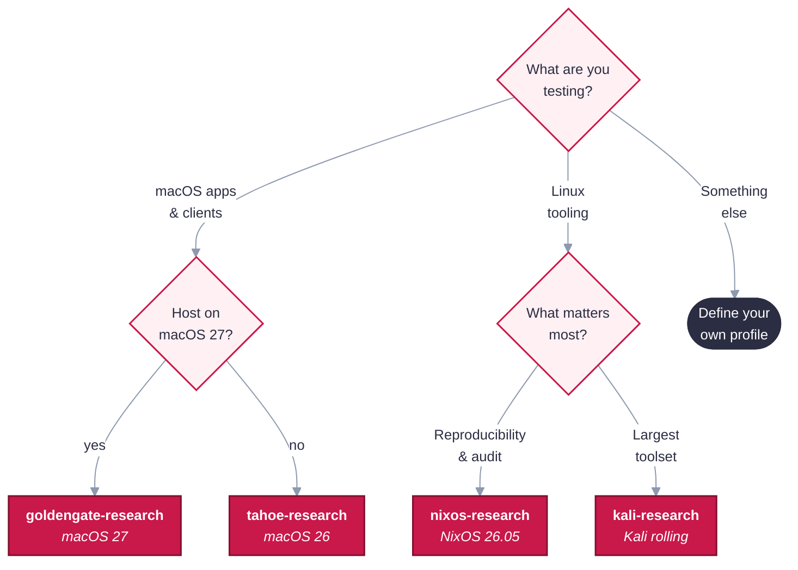

<div align="center">

# 🍓 RhubarbTart

**Provenance-first, hardened security-research VMs for Apple silicon.**
<br/>The trustworthy foundation for agent-driven research, pentests and CTFs: pick a profile, get a
sealed [Tart](https://tart.run) guest whose every input is pinned, verified and proven.


</div>

---

> [!NOTE]
> **Where this is heading:** the goal is to run agents through a management interface
> (herdr) for scoped research, pentests and CTFs inside these VMs, capturing evidence to a
> secure per-engagement vault outside them. See [`docs/PLAN.md`](docs/PLAN.md).

## Why RhubarbTart

**A security result is only as trustworthy as the machine it came from.** Yet research VMs usually
start from someone else's snapshot and drift from there — so you can't say what was really on the
box, can't reproduce a finding a month later, and risk carrying one job's contamination (or one
client's data) into the next.

RhubarbTart removes that doubt. Every guest starts from the **OS vendor's own installer**, **every**
input is pinned in a reviewed lock file and verified **twice** (on the host, then again inside the
guest), and an image isn't given its name until a throwaway clone has **proven** its hardening from
the outside. You end up with a guest whose exact contents you can *prove*, and a disposable clone to
actually work in — so your findings are reproducible, attributable, and never cross-contaminated.
That verified, disposable guest is also the unit the [larger plan](docs/PLAN.md) builds on: isolated
ranges that agents drive and that produce evidence you can trust.

| | |
|---|---|
| 🧾 **Known inputs** | Apple IPSW, NixOS/Kali ISOs, apps and host tools are pinned by hash, checked against vendor signatures where they exist, and locked per guest |
| 🧱 **Hardened by default** | No default passwords, no auto-login, no passwordless sudo for users ([one scoped Kali service-account exception](docs/trust-model.md)), key-only SSH (or none), firewall on, no shared machine or VPN identity |
| 🔬 **Proven, not assumed** | Every image is smoke-tested from outside on a disposable clone before it gets its final name |
| 🧩 **Configurable** | A guest is a small JSON profile: OS base + tools + options. No code needed for new guests |
| 🔐 **Secrets stay yours** | Passwords live in your macOS keychain, each clone gets its own, and VPN enrollment happens per clone at runtime, never baked in |

## What it's for

The pattern is always the same: build a hardened guest whose contents you can prove, work in a
**throwaway clone** of it, and delete the clone when you're done. The golden image is never booted,
so it stays pristine for the next run. Two work patterns this is built for:

**macOS / iOS / Apple-app penetration testing.** Assessing a macOS app, an iOS app and its backend,
or an Apple-ecosystem service needs a clean Apple environment you can trust and repeat. RhubarbTart
hands you a hardened **macOS** guest with your tooling (Chrome, ZAP, a VPN/ZTNA agent) pinned and
verified — no drift from a colleague's snapshot, no mystery software. Because the image's provenance
is recorded and every clone is isolated and disposable, findings are **attributable and
reproducible**: you can state exactly what the box contained, re-run from an identical base, and
never carry one client's state into the next engagement. (Tart runs macOS/Linux guests on Apple
silicon — the macOS guest is the *workbench* for Apple work: simulators, intercepting proxies,
static/dynamic tooling — not an iOS VM.)

**Ephemeral boxes for research and malware analysis.** Detonating a sample or poking at something
hostile demands a box you can trust *before* the run and discard *after* it. Clone the verified
image, do the work in that clone, delete it — and since the golden image never boots, it can't be
contaminated and the next analysis starts from the same **known-clean** state. The recorded
provenance means anything present that *wasn't* in the image is the sample's doing, not leftover
tooling; per-clone identity (and, on the [roadmap](docs/PLAN.md), per-clone network isolation) keeps
one run from reaching another or your host. NixOS and Kali guests give a fully-pinned Linux analysis
box; macOS guests let you study Mac-targeted samples on the platform they actually target.

## Quick start

On an Apple silicon Mac (macOS 26 or later):

```sh
# 1. Install the pinned toolchain (Tart, Packer, plugin, uv, GnuPG built from source) into ./.toolchain. No Homebrew, no sudo.
./tools/bootstrap.sh && source scripts/env.sh && uv run tools/resolve.py preflight

# 2. Resolve a guest's inputs into a lock file, then review and commit it.
uv run tools/resolve.py resolve kali-research && git diff locks/

# 3. Build: install, harden, seal, smoke-test. SSH keys are optional (no keys = no SSH).
ssh-add ~/.ssh/id_ed25519
RHUBARB_SSH_PUBKEYS=~/.ssh/id_ed25519.pub ./scripts/build.sh kali-research

# 4. Work in clones, never in the built image. Each clone gets its own password.
./rhubarb new web-1 --profile kali-research && ./rhubarb run web-1
```

> [!TIP]
> `./scripts/build.sh --list` shows every profile. Builds are long (a full OS install), so run
> them in a spare terminal.

## Choose a guest

| Profile | Base | Tools | Good for |
|---|---|---|---|
| `tahoe-research` | macOS 26 | Chrome, ZAP, WARP, Tailscale | macOS client and app testing on any macOS 26+ host |
| `goldengate-research` | macOS 27 | Chrome, ZAP, WARP, Tailscale | The latest macOS; **needs a macOS 27 host** |
| `nixos-research` | NixOS 26.05 | Chrome, ZAP, WARP, Tailscale · XFCE · Rosetta | Maximum reproducibility: the whole OS is pinned to one commit |
| `kali-research` | Kali rolling | Chrome, ZAP, WARP, Tailscale · `kali-linux-default` · XFCE · Rosetta | Batteries-included offensive tooling |

Perimeter 81 / Harmony SASE is an **opt-in tenant package** (its installer isn't a public download):
add `"perimeter81"` to a macOS profile once you've saved the installer — see
[Define your own guest](docs/profiles.md).



> [!NOTE]
> Guests are arm64 only (Tart runs native guests on Apple silicon). Linux profiles with
> `"rosetta": true` can still run x86_64 Linux binaries through Apple's Rosetta.

## Documentation

The manual lives under [`docs/`](docs/):

- **[How it works](docs/how-it-works.md)** — the Define → Resolve → Build → Prove pipeline that turns a profile into a proven, named image.
- **[Using your VMs](docs/using.md)** — the `rhubarb` CLI and `./rhubarb-tui` dashboard: clone, run, ssh, enroll, reset, rm, and per-clone VPN/ZTNA enrollment.
- **[Define your own guest](docs/profiles.md)** — the profile JSON format, the tool-support matrix, and the strict validation rules.
- **[Trust model and security posture](docs/trust-model.md)** — the per-input chains of trust, the full provenance table, and the hardening posture each family asserts and proves.
- **[Reference](docs/reference.md)** — keeping inputs fresh, configuration variables, host requirements, the pinned toolchain, and the repository map.
- **[Development](docs/development.md)** — `check.sh`, validating off-Mac, and the project skills for Claude Code.

Direction and roadmap: [`docs/PLAN.md`](docs/PLAN.md).

## Known gaps

- [x] **NixOS** built end-to-end on a macOS 27 host: install, harden, seal, smoke test and
      provenance all pass.
- [x] **macOS 27** (`goldengate-research`) built end-to-end on a macOS 27 host: provisioning API
      → password rotation → Chrome/ZAP/WARP/Tailscale install → seal → smoke → provenance.
- [x] **macOS 26** (`tahoe-research`, [#24](https://github.com/errantpacket/RhubarbTart/issues/24)) and **Kali**
      (`kali-research`, [#25](https://github.com/errantpacket/RhubarbTart/issues/25)) built end-to-end on a macOS 27 host,
      including the keystroke Setup Assistant path and the Kali preseed/GRUB flow; Kali ZAP-from-archive
      ([#26](https://github.com/errantpacket/RhubarbTart/issues/26)). Setup Assistant timing is occasionally flaky
      ([#63](https://github.com/errantpacket/RhubarbTart/issues/63)).
- [x] Chrome can't update itself inside macOS clones: auto-updates are off (manual only) via Google's managed
      update policy ([#29](https://github.com/errantpacket/RhubarbTart/issues/29)).
- [x] `TART_TEAM_ID` (`9M2P8L4D89`) and the Packer signer (`D38WU7D763`) pinned after the first
      bootstrap. ZAP needs none (unsigned, hash-pinned); pin Perimeter 81's Team ID when its
      installer is first resolved.
- [x] **Management surface (Phase 0.5).** `tools/rhubarb/` hardened into a typed core API, with a
      Textual TUI (`./rhubarb-tui`) over it — read-only panes plus confirm-gated write actions. The
      agent-platform `herdr` service is the next layer ([#33](https://github.com/errantpacket/RhubarbTart/issues/33)).
      Rationale + layering: [`docs/PLAN.md`](docs/PLAN.md#management-interface--control-plane-api).

Remaining work is tracked as issues (see the [issue tracker](https://github.com/errantpacket/RhubarbTart/issues)):

- Non-admin daily-use account ([#28](https://github.com/errantpacket/RhubarbTart/issues/28)).
- Per-clone isolation via `--net-softnet` ([#30](https://github.com/errantpacket/RhubarbTart/issues/30)) · stacked clones from a private registry ([#31](https://github.com/errantpacket/RhubarbTart/issues/31)) · finish `scripts/publish.sh` + pin `cosign`/`crane` ([#32](https://github.com/errantpacket/RhubarbTart/issues/32)).
- `herdr` service ([#33](https://github.com/errantpacket/RhubarbTart/issues/33)) · choose a license ([#34](https://github.com/errantpacket/RhubarbTart/issues/34)).

---

<div align="center">
<sub>Setup Assistant automation adapted from <a href="https://github.com/cirruslabs/macos-image-templates">cirruslabs/macos-image-templates</a> ·
VMs by <a href="https://github.com/openai/tart">Tart</a> · built with Packer, uv, Nix and a healthy distrust of <code>latest</code>.</sub>
</div>
