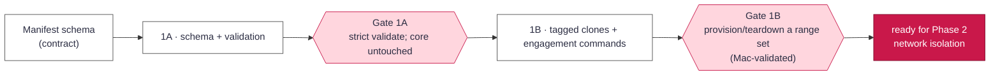

# Engagement Object — Implementation Charter (Phase 1)

_Status: delivered — Phase 1 complete, Gate 1B validated on hardware · branch `dev-engagement`_

Implements **Phase 1** of [`PLAN.md`](PLAN.md) — the **engagement**: the scoped unit that owns a
named set of ranges (VMs), built and torn down as one. See the design in
[`PLAN.md` › Engagements](PLAN.md#engagements-the-unit-of-isolation). Delivers: a committed,
reviewable **scope-manifest** format + strict validation; `rhubarb engagement` commands
(define / list / provision / teardown); and **engagement-tagged clone records**. On the verified-image
+ core-API foundation (Phase 0/0.5) — the CLI/TUI stay thin clients of `tools/rhubarb/api.py`.

**Explicitly not in this phase** (each its own later charter): network isolation (Phase 2), evidence
capture (3), the vault (4), agents/herdr (5), consumption (6), scale (7). To avoid churn, the manifest
schema is defined **in full now** (stable), but Phase 1 only *acts on* identity + ranges; targets,
agent-budget and evidence-policy are validated syntactically and stored for the phases that enforce them.

## Dev practices (every stage)

- Branch per stage off `dev-engagement`; author `errantpacket`; `Co-Authored-By` trailer.
- **Build on the core.** Engagement logic goes in `tools/rhubarb/` and reuses `api.py` / `clones.py`
  (clone, rm, records) — never re-implementing keychain/StrictModes/tart handling. CLI/TUI call the core.
- **Manifests are committed + reviewable** (like `profiles/` and `locks/`); validation is **strict**
  (unknown keys, wrong types, bad values rejected) so a typo can't silently define a different engagement.
- **Tests travel with logic** (schema validation, record tagging, provision/teardown grouping) in
  `tools/test_rhubarb.py`, reference values not code output. `./tools/check.sh` green is the merge bar.
- **Real-VM validation on the Mac** (Terminal.app) for provision/teardown — they clone/rm real VMs and
  touch the keychain; pure logic is validated off-Mac with a mocked core.
- **Hard stage gates**: don't start a stage until the previous gate passes; an integrator owns each gate.

## Stages & gates

### Stage 1A — Scope-manifest schema + validation (foundational, sequential)

A committed `engagements/<id>.json` and a `tools/rhubarb/engagements.py` that loads + validates it into
a stable frozen dataclass (mirroring `profiles.py`'s strictness); **no `tart`, no keychain**. Fields:

- **identity** — `id` (== filename), `label`, `operator`, `authorization` (ticket / RoE / CTF name — *required*, "no manifest, no run").
- **ranges** — a list of `{ "profile": <existing profile id>, "count": N, "prefix"?: <clone-name prefix> }`; profiles must exist and be buildable.
- **targets** — in-bounds hosts / CIDRs / domains / URLs (recorded now; **enforced in Phase 2**).
- **agent_budget**, **evidence** — recorded now; consumed in Phases 5 / 4. Validate types/shape, don't act.

**Gate 1A:** `check.sh` green; a valid manifest parses to the dataclass; unknown keys / bad ranges /
missing `authorization` / unknown profile are rejected with clear errors; `clones.py`/`api.py` behavior
is unchanged (pure addition). Off-Mac.

### Stage 1B — Engagement-tagged clones + `rhubarb engagement` commands

- **Records:** add an `engagement` field to the clone record (`clones.py`) — the engagement a clone
  belongs to, `None` for ad-hoc clones. Keep the StrictModes record trust and schema; **old records
  without the field must still load** (back-compat). `api.new(...)` gains `engagement=<id|None>`.
- **Core ops (`api.py`):** `provision(engagement)` → clone each range's **verified** current image into
  engagement-tagged clones (names from `<engagement>-<profile>-<i>` or the range `prefix`), reusing
  `api.new`; `teardown(engagement)` → `api.rm` every clone tagged to it (idempotent); `engagements()` /
  `engagement_clones(id)` for listing. Refuse to provision from an unbuilt/unverified image.
- **CLI (`rhubarb engagement …`):** `define <file>` (validate + acknowledge), `list`, `provision <id>`,
  `teardown <id> [--yes]`. Thin adapter over the core, like the other commands.

**Gate 1B:** `check.sh` green; unit tests cover record tagging (round-trip + old-record compat) and
provision/teardown grouping (mocked `api.new`/`rm`); then **on the Mac**: a manifest with ≥2 ranges
`provision`s a named, engagement-tagged set of clones from verified images and `teardown` removes
exactly that set (no orphans — reuses the #18 reap), leaving other clones untouched.

After Gate 1B, Phase 1 is done: a manifest defines a set of ranges that build and tear down as a unit.
A TUI engagements view, and `arm`/`run`/evidence, come with later phases.

## Multi-agent execution

Contract-first: Stage 1A freezes `engagements.py` (schema + dataclass) — the shared contract. Stage 1B
builds records + core ops + CLI against it; within 1B, the record/api change and the CLI+tests can run
as separate agents on disjoint files, integrated behind the gate. Mac validation is batched at Gate 1B
(one Mac, GUI-session bound), never parallelized. Heavy fan-out is opt-in; default is a few focused agents.
