# Management interface: implementation charter

_Status: **delivered** 2026-09-26 and merged to `main`. Stages A to C are complete, all gates
passed and were validated on hardware, and #16 to #23 were fixed along the way, including the
input-modal actions (#20). The Phase 5 work got its own charter ([HERDR-CHARTER.md](HERDR-CHARTER.md))
and shipped as the control-plane service (#104) and herdr integration (#108). Later TUI work (#36,
#120 to #123) added a Logs tab and split the app into `tools/rhubarb/tui/`._

Implements **Phase 0.5** of [`PLAN.md`](PLAN.md#management-interface-and-control-plane-api): harden
`tools/rhubarb/` into a typed **core API**, then build a **Textual TUI** over it. This lays the
groundwork for the Phase 5 service. This charter defines the stages, their validation
gates, the dev practices every stage follows, and how multiple agents execute it without stepping
on each other.

The guiding rule from the plan: **one audited core, many thin frontends.** No UI touches `tart`
or the keychain directly, only through the core API.

## Dev practices (every stage)

- **Branch per stage** off `dev-control-plane` (`feat/core-api`, `feat/tui-readonly`,
  `feat/tui-actions`); small, focused commits; author `errantpacket`; `Co-Authored-By` trailer. _(Historical: the branch was merged to `main` and deleted. The current workflow is in CONTRIBUTING.md, "Workflow".)_
- **Contract-first.** Each stage begins by agreeing the public signatures (types + docstrings)
  it exposes or consumes. Downstream work builds against the contract, not the implementation.
- **Tests travel with logic.** Every non-trivial pure function (record parsing, status/outdated
  derivation, formatting) gets a case in `tools/test_rhubarb.py`. Crypto/parsing uses
  reference values, never values this code produced.
- **`./tools/check.sh` green is the merge bar:** shell/Packer/Python lint, offline self-tests,
  profile validation, invariant greps. Runs on Linux; no Mac needed for it.
- **The core stays audited.** New operator operations live in `tools/rhubarb/`; frontends import
  them. Keep the StrictModes clone-record rules, keychain-only secrets, and
  `launchctl asuser` GUI-session handling **inside** the core. Never re-implement them in a UI.
- **Real-VM validation on the Mac** for anything that drives `tart`/keychain, run from
  **Terminal.app** (a GUI session: macOS Local Network Privacy blocks Packer/VM networking from
  SSH-launched processes; keychain writes need the GUI session). Pure logic is validated off-Mac.
- **Stage gates are hard.** Do not begin a stage until the previous gate passes. A gate is a
  written checklist (below); an integrator verifies it before the stage branch merges.

## Stages & gates

```mermaid
flowchart LR
    K["Contract<br/>(API signatures)"] --> A["Stage A<br/>core API + tests"]
    A --> GA{{"Gate A<br/>CLI parity + tests"}}
    GA --> B["Stage B<br/>TUI read-only"]
    B --> GB{{"Gate B<br/>renders real data,<br/>no writes"}}
    GB --> C["Stage C<br/>TUI actions"]
    C --> GC{{"Gate C<br/>actions validated<br/>on the Mac"}}
    GC --> P5["ready for Phase 5<br/>herdr service"]
    classDef s fill:#fff,stroke:#555,color:#2b2d42
    classDef g fill:#ffd6de,stroke:#c9184a,color:#2b2d42
    classDef d fill:#c9184a,stroke:#800f2f,color:#fff
    class K,A,B,C s
    class GA,GB,GC g
    class P5 d
```

### Stage A: core API (foundational, sequential)

Extract a typed internal API from the CLI's logic. Before this stage, `tools/rhubarb/cli.py` mixed
argument parsing, `print`, and orchestration over `clones.py` / `hostops.py` / `locks.py`. Introduce a
single import surface (`tools/rhubarb/api.py`) with **structured returns** (dataclasses),
no `print`/`argv`:

- `images()` → current verified image per profile (from `locks/` + `tart list`), with provenance ref.
- `clones()` → each clone: state, profile, image, outdated?, password mode, enrollments.
- `provenance(vm)` → the `out/<vm>.provenance.json` record, parsed.
- `new(name, profile|image, rotate=True)`, `run(name, …)`, `ssh_args(name)`, `enroll(name, svc, …)`,
  `reset(name, …)`, `rm(name)`: thin wrappers over existing `clones`/`hostops`, returning results
  and raising typed errors instead of exiting.

`cli.py` becomes a thin adapter that formats API returns for the terminal. **No behavior change.**

**Gate A:** `check.sh` green · new API unit tests pass (record parsing, outdated/status
derivation; pure, off-Mac) · **CLI parity**: every existing `rhubarb`/`resolve.py` command
behaves identically (capture before/after output on a scripted run) · no `tart`/keychain calls
outside the core.

**Accepted deviations from the frozen contract (Stage A build):**
- `reset(name, same_image=False, rotate=True)`: the extra `rotate` kwarg is required to preserve
  the CLI's `reset --no-rotate`. It is backward-compatible (default `True` == prior behavior).
- `stop` was not in the contract; `cli.cmd_stop` keeps a thin `clones.load` + `hostops.stop_vm`
  call. Add `api.stop()` at the next contract revision, since Stage C's TUI will want it. (Still
  open: `cmd_stop` calls `clones`/`hostops` directly.)
- One minor stderr difference on the *hard* rotation-failure path (pre-failure progress lines no
  longer stream before the error); exit code and error text unchanged. Inherent to "return/raise,
  never print." Not covered by a test.

### Stage B: TUI, read-only

A Textual app (`tools/rhubarb_tui.py`, launched by a `./rhubarb-tui` shim; the app code now lives
in `tools/rhubarb/tui/`) that **only reads** via the Stage-A API: an images pane (current per profile), a clones pane (state, outdated, password
mode, enrollments), and a provenance detail view. Auto-refresh; no writes, no destructive paths.

> **Decision gate B-0 (first external dependency).** The project was **stdlib-only**, on
> purpose. A TUI framework is the first third-party Python dep, so it must be pinned and
> hash-verified, in keeping with the provenance model. Options, recommendation first:
> 1. **Textual, pinned + hashed via uv** (`uv`'s locked install with `--require-hashes`), recorded
>    like other inputs. Richest TUI, still fully pinned. **Recommended.**
> 2. **Rich only** (lighter dep, simpler render loop, less interactivity).
> 3. **stdlib `curses`** (zero deps, preserves purity; most work, weakest UX).
> Pick before writing Stage B. Whichever wins, add the pin to the toolchain/bootstrap path and a
> `check.sh` assertion, and note it in the provenance/toolchain tables (docs/trust-model.md,
> docs/reference.md).
>
> **Decided: option 1.** Textual is pinned in `tools/rhubarb_tui.py` (PEP 723 metadata) and
> locked with hashes in `tools/rhubarb_tui.py.lock`; `check.sh` asserts that the pin matches the
> lock.

**Gate B:** launches and renders **real** images/clones on the Mac · strictly read-only (grep the
diff: no `new`/`run`/`enroll`/`reset`/`rm` calls) · a headless render test (Textual `Pilot` /
snapshot) with mock API data runs in `check.sh` · dependency pinned + hash-verified per B-0.

### Stage C: TUI, actions

Add operator actions through the Stage-A API: `run`, `ssh`, `enroll`, `reset`, `rm`, and a build
launcher. Destructive actions (`reset`, `rm`) require an explicit typed confirmation; keychain and
GUI-session rules are honored by the core, not the UI. Never act on non-clones or `rbt-*`/`*-vanilla`.

**Gate C:** each action validated against a **throwaway clone** on the Mac (from Terminal.app) ·
destructive ops confirm and target only managed clones · `check.sh` green · no logic duplicated
from the core.

After Gate C, Phase 0.5 is done and the core API and TUI are the base for the Phase 5 service (a
separate charter). That service shipped as stdlib HTTP over a Unix socket, not FastAPI
(`tools/rhubarb/service.py`, #104).

## Multi-agent execution model

Sequential stages, gated; **parallelism lives inside a stage**, bounded by the contract.

| Step | Agents | Work | Handoff |
|---|---|---|---|
| Contract | 1 (lead) | Write the Stage-A signatures + dataclasses + docstrings (no impl). Commit as the contract. | The frozen signatures are the shared interface for everything downstream. |
| Stage A | 2 in parallel | **impl agent**: implement the API over existing modules + slim `cli.py`. **test agent**: write `test_rhubarb.py` cases against the contract. | Integrator runs Gate A. |
| Stage B | up to 3 in parallel | one agent per pane (images / clones / provenance) against the API + a shared app shell. | Integrator merges panes, runs Gate B. |
| Stage C | one per action | `run` / `ssh` / `enroll` / `reset+rm` / build-launcher, each on a sub-branch. | Integrator runs Gate C on the Mac. |

Rules for agents:
- **Build against the contract, not each other's code.** If the contract must change, the lead
  updates it and notifies downstream. No silent divergence.
- **Every agent leaves `check.sh` green** on its sub-branch before handing back.
- An **integrator** (a reviewer agent or the operator) owns each gate: runs the checklist, does
  Mac validation where required, and only then merges the stage branch to `dev-control-plane`.
- Mac-dependent validation is **not** parallelized across agents (one Mac, GUI-session bound); the
  integrator batches it at the gate.
- Heavy fan-out (a `Workflow`) is opt-in and operator-approved; the default is a handful of
  focused `Agent` tasks per stage.

## Out of scope here

The `herdr` service, engagements, network isolation, and the evidence vault (Phases 1 to 7). Those
keep their design in [`PLAN.md`](PLAN.md). Engagements ([ENGAGEMENT-PLAN.md](ENGAGEMENT-PLAN.md))
and herdr ([HERDR-CHARTER.md](HERDR-CHARTER.md)) got their own charters after Phase 0.5 landed.
