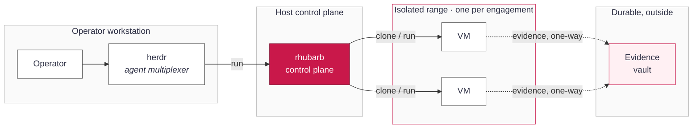

# RhubarbTart: Agent-Driven Research Ranges — Plan

_Status: draft · 2026-09-26_

## Goal & vision

RhubarbTart today builds and manages **hardened, provenance-verified VMs**. The larger goal is
to make those VMs the workbench for **agent-driven security work**: an operator opens a
management interface, defines a scoped exercise, and one or more AI agents carry out the
research, the authorized pentest, or the CTF *inside* isolated Rhubarb VMs — interacting with
the target services through the VM, never from the host.

The defining constraint is **evidence that survives the sandbox**. Everything an agent does in a
VM (commands, tool output, screenshots, captured traffic, findings, and a readable walkthrough)
is captured inside the isolated environment and then exported to a durable store **outside** the
VMs, where a human or another tool can consume it — a report, a CTF write-up, a pentest
deliverable, a training corpus. Each engagement's evidence is kept separate, attributable, and
tamper-evident, so results from one isolated test are never confused with another.

In one sentence: **a control plane that spins up isolated, verified ranges; runs agents in them
under scope and guardrails; and lands trustworthy evidence outside for downstream use.** This
plan covers how the existing profile/lock/clone foundation grows into that platform, and the
security decisions that make the evidence worth trusting.

## Scope and non-goals

**In scope.** Authorized, bounded security work: internal research, scoped penetration tests
against systems the operator is permitted to test, and CTFs. Each is driven by agents running
inside Rhubarb VMs, under an explicit engagement scope, with all evidence captured and exported.

**In scope for the platform to provide:**

- A management interface (herdr as the reference agent multiplexer) to launch, watch, pause and
  stop agents per engagement.
- Engagement definitions that pin scope: which targets are in bounds, which VMs, what the agent
  may do, and where evidence lands.
- Isolation between engagements strong enough that one test cannot see or reach another.
- Evidence capture in the guest and a secure, per-engagement vault outside it.

**Non-goals (explicitly out):**

- **No unauthorized targeting.** The platform refuses to run against anything outside a signed,
  human-approved scope. It is a harness for permitted testing, not a means to broaden it.
- **No offensive capability baked into images.** Tools are installed per profile from verified
  sources; the platform adds orchestration and evidence, not a curated exploit payload set
  beyond what an operator chooses.
- **Not a C2 or botnet.** Agents drive interactive VMs for a bounded engagement; the platform
  does not manage implants on third-party hosts.
- **Not multi-tenant SaaS (yet).** The first target is a single operator (or small team) on
  their own Apple-silicon hardware; a shared service is a later, separate question.
- **The agent's model/provider is out of scope here.** herdr already runs several; this plan is
  about the range, isolation and evidence around whatever agent runs.

## Architecture overview

Five parts, in three trust zones. The **operator** works through a **management interface**
(herdr) that runs agents. Agents don't touch targets directly — they act through the **rhubarb
control plane** (today's `rhubarb` CLI, grown into a small API) which owns the VMs. Each
engagement gets its own **range**: one or more isolated Rhubarb VMs on their own network segment.
Evidence flows one way, out of the range into a per-engagement **vault** that lives outside every
VM.

The key line is the one-way arrow from range to vault: agents and VMs can *write* evidence
outward, but a sealed engagement's vault is append-only and the range can't read another
engagement's data. The host control plane brokers everything; nothing in a range talks to
another range or to the operator's workstation directly.

## Management interface & control-plane API

The architecture calls for a **control plane** (today's `rhubarb` CLI, grown into a small API)
and a **management interface** (herdr). Before building either, we surveyed the Tart ecosystem to
settle build-vs-buy; the finding shapes everything downstream.

**Finding: the core must be ours; only the fleet layer can be bought.** No off-the-shelf tool
models RhubarbTart's domain — provenance-verified images, per-clone keychain secrets,
StrictModes clone records, runtime enrollment, the smoke gate, engagements, and the evidence
vault. Concretely, as of 2026-09:

- **Tart is CLI-first.** Its only GUI renders a *running VM's screen*; there is no
  image/clone/provenance management surface to reuse ([tart.run](https://tart.run/)).
- **Orchard** (cirruslabs, moving under OpenAI with a more permissive license) is a genuine
  orchestration layer: a controller + workers exposing a **REST API + CLI** to schedule Tart VMs
  across a cluster of Apple-silicon hosts. Its API exposes **VMs** (create with
  image/CPU/memory/startup-scripts, get, delete), **Workers**, a **Controller** info endpoint, an
  **Events/logs** stream, and **resource scheduling** (well-known slots such as
  `org.cirruslabs.tart-vms`, ~2 per worker), with **HTTP basic (username/token)** auth. But it
  understands *VMs and placement* — **not** provenance, clone records, secrets, enrollment, the
  smoke gate, or evidence. It is a "where does this VM run" layer, not "what is this VM and can we
  trust it" ([Orchard integration guide](https://tart.run/orchard/integration-guide/),
  [openai/orchard](https://github.com/cirruslabs/orchard)).
- **Generic macOS VM GUIs** (UTM, VirtualBuddy) manage their *own* VMs, not Tart, and structurally
  cannot represent our guarantees; using one would bypass the trust model. Rejected.

**Principle: one audited core, many thin frontends.** The security-critical logic — tart
operations, keychain access, clone-record StrictModes, enrollment, resolve/provenance — lives in
`tools/rhubarb/` and stays there. Every surface (CLI, TUI, the herdr service, later Orchard
integration) is a **thin client of that core**; no frontend touches `tart` or the keychain
directly. The CLI is already layered this way (`cli.py` over `clones.py` / `hostops.py` /
`locks.py`), so the work is to harden those modules into a **stable internal API** (typed entry
points, structured returns — not argv/stdout parsing) that a TUI or service can import. **This
refactor is the prerequisite for Phases 1+ and precedes any UI work**, so the security review has
one place to land.

**Layered surfaces (cheapest first):**

1. **CLI (today).** `rhubarb` for images/clones/enroll; `resolve.py` for build. Remains the ground
   truth and the scripting interface.
2. **TUI — Textual (Python), near-term operator convenience.** Same runtime as the core, pinned
   into `.toolchain`, imports `tools/rhubarb/*` directly, stays inside the local trust boundary and
   the keychain/GUI-session rules. Delivers an image/clone browser, live state, one-key
   run/ssh/enroll/reset/rm, a provenance view, and a build launcher. Days of work; best ROI for
   managing the project as it stands. Optional but recommended before Phase 5.
3. **herdr service — FastAPI + web, the PLAN goal (Phase 5).** The interface for agent-driven
   engagements is inherently bespoke. Build it as a small **localhost-bound, authenticated**
   service exposing the same core plus the engagement/evidence APIs, with herdr (or a web UI) on
   top. This layer can drive VMs and touch the keychain, so it earns a dedicated security review
   and must not bind a listening network interface by default.
4. **Orchard — fleet backend (Phase 7, optional).** When engagements need many ranges across
   multiple Apple-silicon hosts, run range VMs *as* Orchard VMs and have the control plane call
   Orchard's REST API for placement/lifecycle/logs, while `rhubarb` keeps owning provenance,
   records, secrets, enrollment, and evidence. Orchard answers "where does it run"; rhubarb answers
   "what is it and can we trust it." Adopt lazily — it adds a controller/worker deployment and its
   own auth surface.

**What we will not do:** adopt a generic VM GUI (bypasses the guarantees), or let a UI
re-implement clone/keychain logic (forks the security-critical code).

## Engagements: the unit of isolation

The **engagement** is the core new object. It is the boundary that everything else is scoped to:
its VMs, its network, its agents, its evidence. One CTF is one engagement; one scoped pentest is
one engagement; a research spike is one engagement. Nothing crosses that line.

An engagement is defined by a small, human-signed **scope manifest** (committed, reviewable, like
the profile locks):

- **Identity:** a stable id and label, the operator, and an authorization reference (ticket,
  rules-of-engagement doc, CTF name). No manifest, no run.
- **Targets in bounds:** explicit hosts, CIDRs, domains or URLs the engagement may reach — and,
  by omission, everything it may not. For a CTF this is the event's network; for a pentest, the
  signed target list; for research, a lab range.
- **Ranges:** which profiles to build VMs from (`kali-research` for offense, a `nixos-research`
  box for tooling, a macOS guest for client testing) and how many.
- **Agent budget:** which agents may run, for how long, and any hard stops (max spend,
  wall-clock, a kill-time).
- **Evidence policy:** where this engagement's vault is and its retention.

**Network isolation** is what makes the boundary real. Each engagement's VMs sit on their own
segment (Tart softnet, one network per engagement), with egress allowed **only** to the
manifest's in-scope targets and the control plane's evidence sink — default-deny everything else,
including other engagements, the operator's LAN, and the public internet unless scope allows it.
This is enforced on the host, below the guest, so a compromised or misbehaving agent cannot widen
its own reach.

**Lifecycle:** `define → provision (build/clone ranges) → arm (attach agents + scope) → run →
collect (drain evidence) → seal (freeze the vault) → teardown (destroy VMs, keep the vault)`.
Sealing is the one-way door: once an engagement is sealed, its evidence is immutable and its
ranges are gone. A re-test is a new engagement that can reference the old vault, never a
reopening of it.

## Agent orchestration

herdr is the reference management interface: it already runs several agents in parallel, each in
a real PTY, with a persistent server you can detach and reattach over SSH and a sidebar showing
which agents are working, blocked, or idle. RhubarbTart supplies what herdr doesn't: the isolated
range, the scope, and the evidence pipe.

**Where the agent runs.** The agent process runs on the host (inside herdr), and reaches its
engagement's VMs only through the control plane — an `rhubarb`-issued session into the range. The
agent never gets host credentials or raw network access; it gets a handle to "the Kali box in
engagement X" and acts through it. That keeps the powerful, untrusted thing (an autonomous agent)
one layer removed from both the host and the targets. A later option is to run the agent inside
its own per-engagement driver VM for stronger isolation, enabled per engagement in the manifest.

**Model access through a gateway (optional).** The agent's model calls can route through an AI
gateway — such as Cloudflare AI Gateway or AWS Bedrock AgentCore — instead of going straight to
the provider. That gives one place for provider keys, rate and spend limits, and a log of every
prompt and response, which the control plane can pull into the engagement's evidence. The gateway
is pluggable and set per engagement in the manifest; direct provider access stays the default.

**What an agent may do** is the intersection of two things: the engagement's scope manifest, and
a per-agent capability grant. An agent can run tools in its range's VMs, read its own engagement's
state, and write evidence. It cannot change the manifest, reach another engagement, alter the
vault after a write, or touch the control plane's own configuration.

**Guardrails and human approval:**

- **Scope is enforced below the agent,** in host networking, not by asking the agent to behave.
  Out-of-scope traffic is dropped, not trusted-not-to-be-sent.
- **Tiered actions.** Read/enumerate/run-in-VM proceed autonomously; actions the manifest marks
  sensitive (anything reaching a production target, destructive operations, exfiltration-shaped
  moves) pause for operator approval in the interface.
- **Stops are real.** Wall-clock, spend and a manifest kill-time hard-stop the agent and can
  auto-seal the engagement.
- **Everything is logged as evidence** (below), so an agent's actions are auditable after the
  fact, not just watched live.

The division of labor: **herdr drives the agent, the control plane governs the range, the
manifest bounds both.**

## Evidence capture inside the VM

The point of running work in a VM is that the VM knows everything that happened. Capture is a
first-class job, not an afterthought, and it runs **inside each range VM** so it records the
agent's real actions and the services' real responses.

**What gets captured:**

- **Command transcript:** every command and its full output, timestamped, with the working
  directory and user. On Linux via the shell (a logging `PROMPT_COMMAND` / `script` session or a
  recording shell); on macOS the same idea per session.
- **Artifacts:** files the agent creates or pulls — scan outputs, loot, tool reports, exploit
  code, payloads — written under a known capture directory.
- **Screen:** periodic and on-demand screenshots (and optionally a screen recording) for GUI
  steps, so a walkthrough can show, not just tell.
- **Network:** a per-engagement packet capture at the VM's interface (opt-in per manifest), so
  traffic to in-scope targets is preserved.
- **Findings & walkthrough:** the agent writes structured findings (what, where, severity,
  reproduction) and a running narrative to a known path, so the human-readable write-up is a
  product of the run, not reconstructed later.

**How it's structured.** Everything lands under a single tree in the guest (e.g.
`/var/lib/rhubarbtart/evidence/<engagement>/`), append-only from the agent's point of view, with
a manifest that lists each item, its type, size, sha256, and capture time. This is the same
provenance instinct as the build side: an item without a recorded hash isn't evidence.

**Tamper-evidence at the source.** As items are written, the in-guest agent maintains a running
hash chain (each entry commits to the previous), so a later reordering or deletion is detectable.
The chain's head is what gets carried out and signed on export. The guest can't be the final root
of trust — it's the thing under test — so capture is about faithfully recording and committing,
and the *export* step (below) is where trust is anchored outside.

## Evidence export and storage outside the VMs

Evidence is only useful if it outlives the sandbox and can be trusted once it's out. Export is a
deliberate, one-way, host-mediated step — never the VM writing wherever it likes.

**The pull, not a push.** The control plane (not the guest) drains evidence out of a range. It
reads the capture tree over the same host-only channel used to manage the VM — a read-only mount
or an authenticated copy — verifies each item against the in-guest manifest hashes, and writes it
into the engagement's vault. The guest is never handed a credential to the vault; a compromised
agent has nothing to steal and nowhere to push.

**Per-engagement vault.** Each engagement gets its own vault — a directory tree, an object-store
prefix, or an encrypted bundle — keyed to the engagement id. Isolation carries through to rest:
engagement A's evidence and engagement B's never share a key or a namespace, so a leak or a bad
actor in one can't reach the other. The vault holds the artifacts, the transcripts, the pcaps,
the findings, the walkthrough, plus the engagement manifest and the provenance record of the
ranges (which verified images produced this evidence).

**Chain of custody.** On export the control plane records, per item: its hash, its source
(engagement, VM, capture time), and when it was exported and by whom. It closes the in-guest hash
chain, then **signs the vault's root manifest on the host** with a key the guest never sees. That
signature is the anchor the guest couldn't be: anyone consuming the evidence can verify it came
from this engagement, unaltered, and can see the range's provenance behind it. The vault is
**append-only until sealed, immutable after** — the same seal that ends the engagement.

**Encryption and access.** Vaults are encrypted at rest, per-engagement keys held on the host
(keychain / a KMS), so consumption is an explicit decrypt, not an open share. Retention and
who-may-read come from the manifest's evidence policy.

**Consumption.** Because the vault is structured and signed, downstream uses fall out of it:
render the findings + walkthrough into a pentest report or CTF write-up; diff two engagements'
vaults for a re-test; feed transcripts into a training/analysis corpus; or just archive. Nothing
has to be re-derived from a running VM, and every consumer can check what they're trusting.

## Threat model and security controls

The design treats the guest as **untrusted** — it runs an autonomous agent against live targets
and may be compromised by them. Trust lives on the host control plane and in the signed evidence,
never in the range.

| Threat | Control |
|---|---|
| Agent goes out of scope (wrong target, the open internet, another engagement) | Host-enforced per-engagement network isolation, default-deny egress to only in-scope targets + the evidence sink; enforced below the guest |
| Compromised guest tries to reach the host or workstation | Ranges get no host credentials and no route to the LAN; the control plane brokers all access; VMs are hardened and disposable |
| One engagement's data leaking into another | Separate range, network, vault and key per engagement; the control plane is the only thing that spans them |
| Evidence tampered with in the guest | In-guest append-only hash chain; every item re-verified on export; root manifest **signed on the host** with a key the guest never holds |
| Guest tries to exfiltrate to an attacker | Evidence is *pulled* by the host; the guest has no vault credential and no push path |
| Secrets (VPN tokens, target creds) captured in an image or leaking between clones | Existing model: secrets never baked; per-clone identity and passwords; enrollment at runtime only |
| A tampered tool or OS entering a range | Existing provenance chain: every image and package pinned, verified twice, smoke-tested before naming |
| Operator can't trust a deliverable's origin | Signed vault + range provenance record: a consumer verifies engagement, integrity and which verified images produced it |
| Runaway agent (cost, time, blast radius) | Manifest budgets and kill-time; sensitive actions gated on human approval; full audit trail |

**What this design does not defend against, and accepts:** a malicious *operator* (they are
authorized and trusted — this is a tool for permitted work, and abuse is out of scope for the
technical controls); a host fully compromised at the root (it is the trust anchor); and the
agent's own model behavior beyond the scope/guardrail boundary. Those are addressed by
authorization process and by keeping the host itself hardened, not by the range design.

## Phased roadmap

Each phase is usable on its own and builds on the verified foundation already in place (profiles,
locks, the `rhubarb` clone CLI). Nothing here weakens the existing pin/verify/harden/prove
guarantees.

| Phase | Deliverable | Exit criteria |
|---|---|---|
| 0 · Foundation (done) | Profiles, per-profile locks, verified builds, `rhubarb` clone CLI with per-clone identity + runtime enrollment | Clones build, verify and run; NixOS + macOS 27 confirmed on real hardware, macOS 26 + Kali pending |
| 0.5 · Control-plane core API (+ optional TUI) | Harden `tools/rhubarb/` into a typed internal API (structured returns, no argv/stdout parsing); optional Textual TUI over it (see [Management interface](#management-interface--control-plane-api)) | CLI, TUI and the future service all call one audited core; no frontend touches tart/keychain directly |
| 1 · Engagement object | Scope-manifest format + validation; `rhubarb engagement` commands (define/provision/teardown); engagement-tagged clone records | A manifest defines a named set of ranges that build and tear down as a unit |
| 2 · Network isolation | Per-engagement softnet segment; host-enforced default-deny egress to in-scope targets + evidence sink | A range can reach only its scoped targets; other ranges, the LAN and the internet are provably blocked |
| 3 · Evidence capture | In-guest capture (transcript, artifacts, screen, findings) under a known tree; per-item hashes + append-only chain | A run inside a VM produces a hashed, structured evidence tree |
| 4 · Vault + custody | Host-pulled export; per-engagement encrypted vault; signed root manifest + provenance record; seal | Evidence lands outside, verifies against its signature, and is immutable after seal |
| 5 · herdr integration | Launch/scope/stop agents per engagement from the interface; live state + approval prompts; audit into evidence | An operator runs an agent through herdr against a scoped range end to end |
| 6 · Consumption | Renderers: findings + walkthrough → report / CTF write-up; vault verify tool; re-test diff | A sealed vault yields a shareable deliverable a third party can verify |
| 7 · Scale (optional) | Multi-Mac via Orchard; private signed image registry; stacked clones; optional per-engagement agent driver VM | Ranges run across hosts with the same isolation and evidence guarantees |

A useful first milestone is **Phases 1–4 for a single CTF**: define the event as an engagement,
isolate its range, capture what the agent does, and produce a signed vault — before wiring in
herdr or scale.

## Open questions and decisions needed

- **herdr's boundary (decided).** The agent process runs on the host inside herdr and reaches the
  range only through the control plane; an optional per-engagement driver VM is deferred to
  Phase 7. Model calls may optionally go through an AI gateway (Cloudflare AI Gateway, AWS Bedrock
  AgentCore) — which one, if any, is still to pick.
- **Evidence transport.** Read-only virtiofs/dir-share from guest to host, an authenticated pull
  over the host-only SSH channel, or the tart-guest-agent? Each has different trust and
  macOS-vs-Linux support.
- **Signing key custody.** Where does the host signing key live — macOS keychain, a hardware key,
  or a small KMS — and is one root key acceptable, or one per operator?
- **Vault backend.** Local encrypted bundles first, or object storage (S3-style) from the start?
  Object storage helps consumption and multi-host but adds a dependency and its own auth.
- **Scope enforcement granularity.** Is CIDR/host/port default-deny enough, or do we need L7
  (domains, URLs) for web CTFs and app pentests — and if so, a filtering proxy in the path?
- **CTF vs pentest divergence.** CTFs are self-contained and permissive within the event; pentests
  need tight target lists and heavier approval. One manifest schema with modes, or separate ones?
- **Live oversight vs autonomy.** Which actions truly require human approval by default, and can
  that set be per-engagement without becoming a rubber stamp?
- **First target.** Which concrete engagement do we build Phases 1–4 against — a specific CTF, or
  a lab pentest range you already have authorization for?

These are the decisions that most change the build order; the rest of the plan holds regardless of
how they land.
