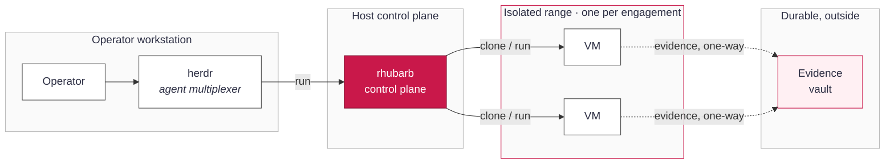

# RhubarbTart plan: agent-driven research ranges

_Status: design record, written 2026-09-26, status updated 2026-09-30. Phases 0 to 5 have
shipped in a first form, and parts of 6 and 7. Where the build differs from this design, the
section says so. The [phased roadmap](#phased-roadmap) shows what shipped and where it lives._

## Goal and vision

RhubarbTart today builds and manages **hardened, provenance-verified VMs**. The larger goal is
to make those VMs the workbench for **agent-driven security work**. An operator opens a
management interface and defines a scoped exercise. Then one or more AI agents carry out the
research, the authorized pentest or the CTF *inside* isolated Rhubarb VMs. The agents interact
with the target services through the VM, never from the host.

The defining constraint is **evidence that survives the sandbox**. Everything an agent does in a
VM (commands, tool output, screenshots, captured traffic, findings, and a readable walkthrough)
is captured and then exported to a durable store **outside** the VMs. There a human or another
tool can use it: a report, a CTF write-up, a pentest deliverable, a training corpus. Each
engagement's evidence is kept separate, attributable and tamper-evident, so results from one
isolated test are never confused with another.

In one sentence: **a control plane that spins up isolated, verified ranges; runs agents in them
under scope and guardrails; and lands trustworthy evidence outside for downstream use.** This
plan covers how the existing profile/lock/clone foundation grows into that platform, and the
security decisions that make the evidence worth trusting.

## Scope and non-goals

**In scope.** Authorized, bounded security work: internal research, scoped penetration tests
against systems the operator is permitted to test, and CTFs. Agents running inside Rhubarb VMs
drive each one, under an explicit engagement scope, with all evidence captured and exported.

**In scope for the platform to provide:**

- A management interface (herdr as the reference agent multiplexer) to launch, watch, pause and
  stop agents per engagement.
- Engagement definitions that pin scope: which targets are in bounds, which VMs, what the agent
  may do, and where evidence lands.
- Isolation between engagements strong enough that one test cannot see or reach another.
- Evidence capture and a secure, per-engagement vault outside the VMs.

**Non-goals (explicitly out):**

- **No unauthorized targeting.** The platform refuses to run against anything outside a signed,
  human-approved scope. It is a harness for permitted testing, not a means to broaden it.
- **No offensive capability baked into images.** Tools are installed per profile from verified
  sources. The platform adds orchestration and evidence, not a curated exploit payload set
  beyond what an operator chooses.
- **Not a C2 or botnet.** Agents drive interactive VMs for a bounded engagement; the platform
  does not manage implants on third-party hosts.
- **Not multi-tenant SaaS (yet).** The first target is a single operator (or small team) on
  their own Apple-silicon hardware. A shared service is a later, separate question.
- **The agent's model or provider is out of scope here.** herdr already runs several. This plan
  covers the range, isolation and evidence around whatever agent runs.

## Architecture overview

Five parts, in three trust zones. The **operator** works through a **management interface**
(herdr) that runs agents. Agents don't touch targets directly. They act through the **rhubarb
control plane** (the `rhubarb` CLI, grown into a small API), which owns the VMs. Each
engagement gets its own **range**: one or more isolated Rhubarb VMs. Evidence flows one way, out
of the range into a per-engagement **vault** that lives outside every VM.

The key line is the one-way arrow from range to vault. Evidence moves outward only. A sealed
engagement's vault is immutable, and a range can't read another engagement's data. The host
control plane brokers everything; nothing in a range talks to another range or to the
operator's workstation directly.

## Management interface and control-plane API

The architecture calls for a **control plane** (the `rhubarb` CLI, grown into a small API) and a
**management interface** (herdr). Before building either, we surveyed the Tart ecosystem to
settle build-vs-buy. The finding shapes everything downstream.

**Finding: the core must be ours; only the fleet layer can be bought.** No off-the-shelf tool
models RhubarbTart's domain: provenance-verified images, per-clone keychain secrets,
StrictModes clone records, runtime enrollment, the smoke gate, engagements, and the evidence
vault. As of 2026-09:

- **Tart is CLI-first.** Its only GUI renders a *running VM's screen*. There is no
  image/clone/provenance management surface to reuse ([tart.run](https://tart.run/)).
- **Orchard** (cirruslabs, moving under OpenAI with a more permissive license) is an
  orchestration layer: a controller and workers exposing a **REST API and CLI** to schedule Tart
  VMs across a cluster of Apple-silicon hosts. Its API exposes **VMs** (create with
  image/CPU/memory/startup-scripts, get, delete), **Workers**, a **Controller** info endpoint, an
  **Events/logs** stream, and **resource scheduling** (well-known slots such as
  `org.cirruslabs.tart-vms`, about 2 per worker), with **HTTP basic (username/token)** auth. But
  it understands *VMs and placement*, **not** provenance, clone records, secrets, enrollment, the
  smoke gate or evidence. It answers "where does this VM run", not "what is this VM and can we
  trust it" ([Orchard integration guide](https://tart.run/orchard/integration-guide/),
  [openai/orchard](https://github.com/cirruslabs/orchard)).
- **Generic macOS VM GUIs** (UTM, VirtualBuddy) manage their *own* VMs, not Tart, and cannot
  represent our guarantees. Using one would bypass the trust model. Rejected.

**Principle: one audited core, many thin frontends.** The security-critical logic (tart
operations, keychain access, clone-record StrictModes, enrollment, resolve/provenance) lives in
`tools/rhubarb/` and stays there. Every surface (CLI, TUI, the control-plane service, later
Orchard integration) is a **thin client of that core**. No frontend touches `tart` or the keychain
directly. The CLI was already layered this way (`cli.py` over `clones.py` / `hostops.py` /
`locks.py`). The work was to harden those modules into a **stable internal API** (typed entry
points, structured returns, no argv/stdout parsing) that a TUI or service can import. **This
refactor was the prerequisite for Phases 1+ and came before any UI work**, so the security review
has one place to land. It is done: `tools/rhubarb/api.py` (Phase 0.5,
[INTERFACE-PLAN.md](INTERFACE-PLAN.md)).

**Layered surfaces (cheapest first):**

1. **CLI.** `rhubarb` for images, clones, enrollment and engagements; `resolve.py` for build. It
   remains the ground truth and the scripting interface.
2. **TUI: Textual (Python), operator convenience (done, Phase 0.5).** Same runtime as the core,
   pinned by `uv` (`tools/rhubarb_tui.py.lock`), imports `tools/rhubarb/*` directly, and stays
   inside the local trust boundary and the keychain/GUI-session rules. It has an image/clone
   browser, live state, one-key run/ssh/enroll/reset/rm, a provenance view, a build launcher and
   a Logs tab. Launched by `./rhubarb-tui`; the app lives in `tools/rhubarb/tui/`.
3. **Control-plane service and herdr (done, Phase 5).** The interface for agent-driven
   engagements is bespoke. The plan was a small **localhost-bound, authenticated** FastAPI service
   exposing the same core plus the engagement and evidence APIs, with herdr (or a web UI) on top.
   As built (#104), it is `rhubarb serve`: stdlib HTTP over a Unix domain socket at 0600, with no
   TCP port and no web framework to pin (`tools/rhubarb/service.py`). herdr integration followed
   in #108. This layer can drive VMs and touch the keychain, so it gets a dedicated security
   review and does not bind a network interface.
4. **Orchard: fleet backend (Phase 7, optional, not started).** When engagements need many ranges
   across multiple Apple-silicon hosts, run range VMs *as* Orchard VMs. The control plane would
   call Orchard's REST API for placement, lifecycle and logs, while `rhubarb` keeps owning
   provenance, records, secrets, enrollment and evidence. Orchard answers "where does it run";
   rhubarb answers "what is it and can we trust it". Adopt only when needed, because it adds a
   controller/worker deployment and its own auth surface.

**What we will not do:** adopt a generic VM GUI (bypasses the guarantees), or let a UI
re-implement clone/keychain logic (forks the security-critical code).

## Engagements: the unit of isolation

The **engagement** is the core new object. Everything else is scoped to it: its VMs, its
network, its agents, its evidence. One CTF is one engagement; one scoped pentest is one
engagement; a research spike is one engagement. Nothing crosses that line. Phase 1 built it
([ENGAGEMENT-PLAN.md](ENGAGEMENT-PLAN.md), `tools/rhubarb/engagements.py`, `engagements/`).

An engagement is defined by a small, human-signed **scope manifest** (committed and reviewable,
like the profile locks):

- **Identity:** a stable id and label, the operator, and an authorization reference (ticket,
  rules-of-engagement doc, CTF name). No manifest, no run.
- **Targets in bounds:** explicit hosts, CIDRs, domains or URLs the engagement may reach and,
  by omission, everything it may not. For a CTF this is the event's network; for a pentest, the
  signed target list; for research, a lab range.
- **Ranges:** which profiles to build VMs from (`kali-research` for offense, a `nixos-research`
  box for tooling, a macOS guest for client testing) and how many.
- **Agent budget:** which agents may run, for how long, and any hard stops (max spend,
  wall-clock, a kill-time).
- **Evidence policy:** where this engagement's vault is and its retention.

**Network isolation** is what makes the boundary real. The design put each engagement's VMs on
their own segment (Tart Softnet, one network per engagement), with egress allowed **only** to
the manifest's in-scope targets and the control plane's evidence sink. Everything else would be
default-deny, including other engagements, the operator's LAN, and the public internet unless
scope allows it. This is enforced on the host, below the guest, so a compromised or misbehaving
agent cannot widen its own reach.

_As built (#30, #95):_ Softnet was evaluated and rejected for now. It needs an unsigned root
helper and breaks the images' SSH `from="192.168.64.1"` pin (reasons on #30). Tart's default NAT
network already keeps clones from reaching each other. An engagement opens attacker-to-target
paths only through explicit manifest `links`, which `rhubarb engagement connect ID` opens as
`ssh -R` tunnels until Ctrl-C. Lab targets have no egress (systemd `IPAddressDeny` plus a
firewall rule, checked by the smoke test). The manifest's `targets` list is validated and stored
but not yet enforced. Moving targets to Tart's native host-only network is #94.

**Lifecycle:** `define → provision (build/clone ranges) → arm (attach agents + scope) → run →
collect (drain evidence) → seal (freeze the vault) → teardown (destroy VMs, keep the vault)`.
Sealing is the one-way door: once an engagement is sealed, its evidence is immutable and its
ranges are gone. A re-test is a new engagement that can reference the old vault, never a
reopening of it.

## Agent orchestration

> The boundary herdr must respect is fixed in the **[herdr charter](HERDR-CHARTER.md)** (#33),
> written before any herdr code. This section is the background it draws on.

herdr is the reference management interface. It runs several agents in parallel, each in a real
PTY, with a persistent server you can detach and reattach over SSH, and a sidebar showing which
agents are working, blocked or idle. RhubarbTart supplies what herdr doesn't: the isolated range,
the scope and the evidence pipe.

**Where the agent runs.** The agent process runs on the host (inside herdr) and reaches its
engagement's VMs only through the control plane, in an `rhubarb`-issued session into the range.
The agent never gets host credentials or raw network access. It gets a handle to "the Kali box in
engagement X" and acts through it. That keeps the untrusted part (an autonomous agent) one layer
removed from both the host and the targets. As built, the handle is `rbt-range`
(`tools/rhubarb_agent.py`, `tools/rhubarb/agent.py`), pinned to one clone by `rhubarb herdr arm
ID`. A later option is to run the agent inside its own per-engagement driver VM for stronger
isolation, enabled per engagement in the manifest.

**Model access through a gateway (optional).** The agent's model calls can route through an AI
gateway, such as Cloudflare AI Gateway or AWS Bedrock AgentCore, instead of going straight to the
provider. That gives one place for provider keys, rate and spend limits, and a log of every
prompt and response, which the control plane can pull into the engagement's evidence. The gateway
is pluggable and set per engagement in the manifest; direct provider access stays the default.
Not built yet; tracked in #103.

**What an agent may do** is the intersection of two things: the engagement's scope manifest, and
a per-agent capability grant. An agent can run tools in its range's VMs, read its own engagement's
state, and write evidence. It cannot change the manifest, reach another engagement, alter the
vault after a write, or touch the control plane's own configuration.

**Guardrails and human approval:**

- **Scope is enforced below the agent,** in host networking, not by asking the agent to behave.
  Out-of-scope traffic is dropped, not trusted-not-to-be-sent.
- **Tiered actions.** Read/enumerate/run-in-VM proceed autonomously. Actions marked sensitive
  (anything reaching a production target, destructive operations, exfiltration-shaped moves)
  pause for operator approval. As built (#111), the markings are regexes in
  `engagements/<id>.herdr.json`, and the operator releases a held command with
  `rhubarb herdr approve`.
- **Stops are real.** Wall-clock, spend and a manifest kill-time hard-stop the agent and can
  auto-seal the engagement. The manifest validates these fields; runtime enforcement is not built
  yet.
- **Everything is logged as evidence** (below), so an agent's actions are auditable after the
  fact, not only watched live.

The division of labor: **herdr drives the agent, the control plane governs the range, the
manifest bounds both.**

## Evidence capture inside the VM

The point of running work in a VM is that the VM knows everything that happened. Capture is a
first-class job. The design runs it **inside each range VM**, so it records the agent's real
actions and the services' real responses.

**What gets captured:**

- **Command transcript:** every command and its full output, timestamped, with the working
  directory and user. On Linux via the shell (a logging `PROMPT_COMMAND` / `script` session or a
  recording shell); on macOS the same idea per session.
- **Artifacts:** files the agent creates or pulls (scan outputs, loot, tool reports, exploit
  code, payloads), written under a known capture directory.
- **Screen:** periodic and on-demand screenshots (and optionally a screen recording) for GUI
  steps, so a walkthrough can show, not only tell.
- **Network:** a per-engagement packet capture at the VM's interface (opt-in per manifest), so
  traffic to in-scope targets is preserved.
- **Findings and walkthrough:** the agent writes structured findings (what, where, severity,
  reproduction) and a running narrative to a known path, so the human-readable write-up is a
  product of the run, not reconstructed later.

**How it's structured.** Everything lands under a single tree in the guest (for example
`/var/lib/rhubarbtart/evidence/<engagement>/`), append-only from the agent's point of view, with
a manifest that lists each item, its type, size, sha256 and capture time. This is the same
provenance habit as the build side: an item without a recorded hash isn't evidence.

**Tamper-evidence at the source.** As items are written, the in-guest agent maintains a running
hash chain (each entry commits to the previous), so a later reordering or deletion is detectable.
The chain's head is carried out and signed on export. The guest can't be the final root of trust,
because it is the thing under test. So capture is about recording and committing faithfully, and
the *export* step (below) anchors trust outside.

_As built (#85, #99):_ the record moved to the host. The guest never holds it.
`tools/rhubarb/evidence.py` keeps a hash-chained `journal.jsonl` and content-addressed
`items/<sha256>` per engagement in the host state directory. Entry kinds are `exec`, `artifact`,
`ground_truth`, `lifecycle` and `approval`. `rhubarb exec` journals each command and its output
as it runs. `rhubarb evidence collect` pulls each clone's `~/evidence` over SSH and hashes files
on arrival. `rhubarb evidence list|verify` reads and checks the chain, and teardown collects
first. Screenshots and packet capture are not captured yet.

## Evidence export and storage outside the VMs

Evidence is only useful if it outlives the sandbox and can be trusted once it's out. Export is a
deliberate, one-way, host-mediated step. The VM never writes wherever it likes.

**The pull, not a push.** The control plane (not the guest) drains evidence out of a range. It
reads the capture tree over the same host-only channel used to manage the VM (a read-only mount
or an authenticated copy), verifies each item against the in-guest manifest hashes, and writes it
into the engagement's vault. The guest never gets a credential to the vault, so a compromised
agent has nothing to steal and nowhere to push.

**Per-engagement vault.** Each engagement gets its own vault (a directory tree, an object-store
prefix, or an encrypted bundle) keyed to the engagement id. Isolation carries through to rest:
engagement A's evidence and engagement B's never share a key or a namespace, so a leak or a bad
actor in one can't reach the other. The vault holds the artifacts, the transcripts, the pcaps,
the findings and the walkthrough. It also holds the engagement manifest and the provenance record
of the ranges (which verified images produced this evidence).

**Chain of custody.** On export the control plane records, per item: its hash, its source
(engagement, VM, capture time), and when it was exported and by whom. It closes the hash chain,
then **signs the vault's root manifest on the host** with a key the guest never sees. That
signature is the anchor the guest couldn't be. Anyone consuming the evidence can verify it came
from this engagement, unaltered, and can see the range's provenance behind it. The vault is
**append-only until sealed, immutable after**, using the same seal that ends the engagement.

**Encryption and access.** Vaults are encrypted at rest, with per-engagement keys held on the
host (keychain or a KMS), so reading one is an explicit decrypt, not an open share. Retention and
who-may-read come from the manifest's evidence policy.

_As built (#86, #101):_ `rhubarb vault seal ID` (`tools/rhubarb/vault.py`, `scripts/vault.sh`)
writes a local `<engagement>-<sealed-at>.vault/` bundle. It holds `root.json` (scope, chain head,
journal and item hashes, range provenance), the journal, the items, and a
`cosign sign-blob --bundle` signature made offline with the publisher key from the host keychain.
The bundle is made read-only on seal, and `rhubarb vault verify` checks it with nothing else on
hand. Encryption at rest is not built yet (#100); until then confidentiality rests on the host
disk (FileVault).

**Consumption.** Because the vault is structured and signed, downstream uses follow from it:
render the findings and walkthrough into a pentest report or CTF write-up; diff two engagements'
vaults for a re-test; feed transcripts into a training or analysis corpus; or archive it.
Nothing has to be re-derived from a running VM, and every consumer can check what they're
trusting.

## Threat model and security controls

The design treats the guest as **untrusted**: it runs an autonomous agent against live targets
and may be compromised by them. Trust lives on the host control plane and in the signed evidence,
never in the range.

| Threat | Control |
|---|---|
| Agent goes out of scope (wrong target, the open internet, another engagement) | Host-enforced per-engagement network isolation, default-deny egress to only in-scope targets + the evidence sink; enforced below the guest |
| Compromised guest tries to reach the host or workstation | Ranges get no host credentials and no route to the LAN; the control plane brokers all access; VMs are hardened and disposable |
| One engagement's data leaking into another | Separate range, network, vault and key per engagement; the control plane is the only thing that spans them |
| Evidence tampered with in the guest | In-guest append-only hash chain; every item re-verified on export; root manifest **signed on the host** with a key the guest never holds |
| Guest tries to exfiltrate to an attacker | Evidence is *pulled* by the host; the guest has no vault credential and no push path |
| Secrets (VPN tokens, target creds) captured in an image or leaking between clones | Existing model: secrets never baked; per-clone identity and passwords; enrollment at runtime only |
| A tampered tool or OS entering a range | Existing provenance chain: every image and package pinned, verified twice, smoke-tested before naming |
| Operator can't trust a deliverable's origin | Signed vault + range provenance record: a consumer verifies engagement, integrity and which verified images produced it |
| Runaway agent (cost, time, blast radius) | Manifest budgets and kill-time; sensitive actions gated on human approval; full audit trail |

As built, three controls differ from the table. Isolation is Tart NAT plus explicit links and
no-egress lab targets, not per-engagement default-deny egress (#30). The hash chain lives on the
host, not in the guest (#85). Vaults share one signing key and are not yet encrypted per
engagement (#100). Manifest budgets are validated but not enforced at runtime.

**What this design does not defend against, and accepts:** a malicious *operator* (they are
authorized and trusted; this is a tool for permitted work, and abuse is out of scope for the
technical controls); a host fully compromised at the root (it is the trust anchor); and the
agent's own model behavior beyond the scope and guardrail boundary. Authorization process and a
hardened host address those, not the range design.

## Phased roadmap

Each phase is usable on its own and builds on the verified foundation (profiles, locks, the
`rhubarb` clone CLI). Nothing here weakens the existing pin/verify/harden/prove guarantees.

| Phase | Deliverable | Exit criteria |
|---|---|---|
| 0 · Foundation (done) | Profiles, per-profile locks, verified builds, `rhubarb` clone CLI with per-clone identity + runtime enrollment | Clones build, verify and run. NixOS, macOS 26 (#24), macOS 27 and Kali (#25) confirmed on real hardware; macOS 26 stage 1 is still flaky (#63) |
| 0.5 · Control-plane core API + TUI (done) | `tools/rhubarb/api.py` typed core (structured returns, no argv/stdout parsing); `./rhubarb-tui` Textual dashboard over it, with read-only panes and confirm-gated actions (run/ssh/enroll/new/reset/rm/build). See [Management interface](#management-interface-and-control-plane-api) and [INTERFACE-PLAN.md](INTERFACE-PLAN.md) | Delivered: CLI, TUI and the service all call one audited core; no frontend touches tart/keychain directly; hardware-validated |
| 1 · Engagement object (done) | Scope-manifest format + validation; `rhubarb engagement` commands (define/list/provision/teardown); engagement-tagged clone records. See [ENGAGEMENT-PLAN.md](ENGAGEMENT-PLAN.md) | A manifest defines a named set of ranges that build and tear down as a unit; Gate 1B validated on hardware (#44) |
| 2 · Network isolation (done, changed design) | Planned: per-engagement Softnet segment with default-deny egress. Built (#30, #95): Tart NAT keeps clones apart; explicit manifest `links` opened by `rhubarb engagement connect`; lab targets have no egress. Softnet rejected for now | Mac-validated on `juiceshop-lab` (#30): no direct attacker-to-target route without a link; the target cannot reach the internet or the host |
| 3 · Evidence capture (done, host-side) | Hash-chained journal + content-addressed items on the host (`tools/rhubarb/evidence.py`, #85, #99); `rhubarb exec` journaling; `rhubarb evidence collect\|list\|verify`. Screen and packet capture not built | An engagement run produces a hashed, structured, verifiable evidence record |
| 4 · Vault + custody (done, no encryption yet) | Host-pulled export; signed root manifest + provenance record; seal (`tools/rhubarb/vault.py`, `scripts/vault.sh`, #86, #101). Encryption at rest is #100 | Evidence lands outside, verifies against its signature (`rhubarb vault verify`), and is read-only after seal |
| 5 · herdr integration (done) | Control-plane service `rhubarb serve` (#104: #105, #106, #107); scoped range client `rbt-range`, `rhubarb herdr arm`, tiered approvals (#108: #109, #110, #111). Budget enforcement, prompt capture and the per-engagement agent VM are tracked in #126 | Mac-validated (#111): a tiered command was held, approved, then ran, and the exchange verifies in the journal |
| 6 · Consumption (partly done) | Vault verify tool (done, `rhubarb vault verify`). Not built: renderers (findings + walkthrough → report / CTF write-up), re-test diff | A sealed vault yields a shareable deliverable a third party can verify |
| 7 · Scale (optional, partly done) | Done: signed image registry on localhost (#32) and stacked clones via `rhubarb new --from-registry` (#31). Not built: multi-Mac via Orchard, per-engagement agent driver VM | Ranges run across hosts with the same isolation and evidence guarantees |

The first milestone was **Phases 1 to 4 for a single engagement**, before wiring in herdr or
scale: define the engagement, isolate its range, capture what the agent does, and produce a
signed vault. It was built against the `juiceshop-lab` lab (Kali attacker, OWASP Juice Shop
target; #83, #84) rather than a CTF.

## Open questions and decisions needed

- **herdr's boundary (decided).** The agent process runs on the host inside herdr and reaches the
  range only through the control plane. An optional per-engagement driver VM is deferred to
  Phase 7. Model access is direct for now; an optional AI gateway (Cloudflare AI Gateway, AWS
  Bedrock AgentCore) is tracked in #103.
- **Evidence transport (decided).** The options were a read-only virtiofs/dir-share from guest to
  host, an authenticated pull over the host-only SSH channel, or the tart-guest-agent. Each has
  different trust and macOS-vs-Linux support. `rhubarb evidence collect` uses the SSH pull (#85).
- **Signing key custody (decided for now).** Vaults are signed with the same offline cosign key
  that signs published images. The private key and passphrase live in the host login keychain
  (`scripts/signing-key.sh`). One key per publisher; hardware keys and a KMS were not adopted.
- **Vault backend (decided for now).** Local bundles first (#86). Object storage (S3-style) would
  help consumption and multi-host use, but adds a dependency and its own auth. Encryption at rest
  is #100.
- **Scope enforcement granularity (decided for now).** Host and port rules are enough for the
  first lab, with no domain or URL proxy yet (owner decision on #30). L7 filtering for web CTFs
  and app pentests is still open.
- **CTF vs pentest divergence.** CTFs are self-contained and permissive within the event; pentests
  need tight target lists and heavier approval. One manifest schema with modes, or separate ones?
- **Live oversight vs autonomy.** Which actions require human approval by default, and can that
  set be per-engagement without becoming a rubber stamp? Today each engagement's herdr config lists
  its tiered commands (#111); the defaults are still open.
- **First target (decided).** The `juiceshop-lab` engagement (#83, #84).

These are the decisions that most change the build order; the rest of the plan holds regardless of
how they land.
