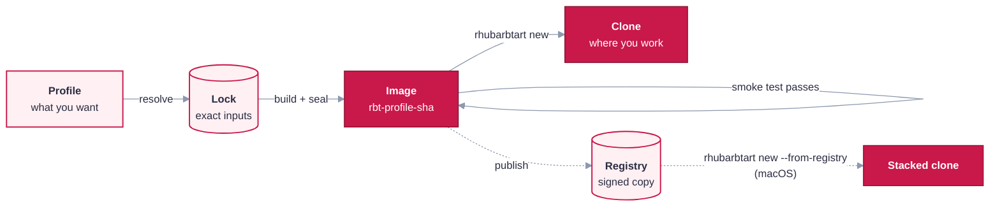

# Key concepts

RhubarbTart uses a handful of words in a specific sense. This page explains each one in plain
language. They are ordered to follow the lifecycle of a guest: from what you **ask for**, to what
gets **built**, to what you **work in**. The collapsed sections go deeper.

## What you ask for

**Profile.** A small JSON file (`profiles/<name>.json`) describing one kind of guest. It names an
OS **base**, a list of **packages** (tools), and a few options such as the desktop, VM size,
username or Rosetta. It's the only file you normally write. See [Define your own guest](profiles.md).

**Base.** The operating system a profile starts from: macOS 26, macOS 27, NixOS or Kali
(`config/bases/*.json`). A base says where the vendor's installer comes from and how it's verified.

**Package.** One tool that can go into a guest, such as Chrome, ZAP, WARP or Tailscale
(`config/packages/*.json`). A package has a variant per OS family, because Chrome for macOS and
Chrome for Kali are different downloads with different ways to verify them.

## What gets pinned

**Input.** Anything downloaded from outside that ends up in a guest: the OS installer (an Apple
**IPSW**, or a NixOS/Kali **ISO**), each app installer or `.deb`, and for NixOS the package
collection (`nixpkgs`). Inputs are the things RhubarbTart refuses to trust blindly.

**Lock file.** `locks/<profile>.lock.json` records the **exact** inputs for one profile: every URL,
version, SHA-256 hash and, where the vendor signs, the signer. The lock is produced by
**resolving**, reviewed by a person, and committed. A build uses what the lock says and nothing
else, so the same lock always means the same inputs, even months later.

<b>Resolve vs verify, and the download cache</b>

- **Resolve** (`resolve.py resolve <profile>`) looks upstream for the newest suitable versions,
  downloads them, checks them against at least two independent sources (for example a signed
  checksum file *and* a published digest), and **writes a new lock**. You review its diff before
  committing, like code.
- **Verify** (run automatically by every build) re-checks the downloaded files against the
  **existing** lock. It never picks new versions.
- **The cache** (`cache/artifacts/<sha256>/<file>`) holds the downloads, filed by their hash. Two
  profiles can therefore pin different builds of a file with the same name (Chrome's installer
  URL is unversioned) without overwriting each other.
- **Trust on first use (TOFU).** A few vendors publish no hash at all (Chrome and WARP on macOS).
  For those, the hash is recorded the first time it's downloaded, and the macOS signature and
  **Team ID** (the vendor's Apple developer identity, pinned in config) are still checked every
  time. The lock marks these as `tofu:`, so they get a closer look in review.

## What gets built

**Image.** The finished, hardened VM that a profile's lock produces, named
`rbt-<profile>-<12 hex chars>` (for example `rbt-kali-research-0ff4b8e78398`). The suffix is
derived from the **inputs**, so the same lock always yields the same name, and a changed input
yields a new one. An image is a **template**: you never boot it, so it stays exactly as built.

<b>How a build gets there: vanilla VM, seal, smoke test, provenance</b>

- **Vanilla VM** (macOS only). A plain macOS install that has been through Setup Assistant
  (`rbt-macos-27-<build>-vanilla`). It's built once per macOS build and reused by later
  rebuilds, which then only add the apps. `REBUILD_VANILLA=1` forces a fresh one.
- **Re-verification in the guest.** Every staged file is checked against the lock again *inside*
  the guest before it's installed, so the host and the guest each vouch for the inputs.
- **Seal.** The last build step inside the guest (`finalize.sh`). It turns on the hardening
  (firewall, key-only SSH or none, no auto-login, no passwordless sudo), **asserts** each of those
  actually holds, removes build leftovers and per-machine identity, retires any temporary password
  the installer needed, and powers off.
- **`-unverified`.** Until it's proven, the new image carries this suffix. It is never used for
  clones.
- **Smoke test.** A throwaway clone of the `-unverified` image is booted and checked **from the
  outside**: password login refused, key login works, firewall on, no passwordless sudo, and so
  on. Only if every check passes is the image renamed to its final name. A failed candidate is
  kept for inspection.
- **Provenance record.** `out/<image>.provenance.json` records what went into the image: the lock,
  the git commit (and whether the tree was clean), the host toolchain versions, the hash of every
  build file, and whether SSH was enabled. It's how you prove later what an image contains.

## What you work in

**Clone.** A disposable copy of an image, made with `rhubarbtart new`. This is where you actually
work. On macOS's file system (APFS) a clone is **copy-on-write**: it shares the image's data and
only stores what changes, so it's fast and cheap. Delete it when you're done; the image is
untouched and the next clone starts identical.

**Per-clone password.** Every clone is rotated to its **own** random password as it's created,
stored in your macOS keychain under the clone's name. `rhubarbtart` proves the old (image) password
no longer works, so no two clones share a credential. VPN/ZTNA enrollment also happens per
clone and is never baked into an image.

**Engagement.** A named scope (`engagements/<id>.json`) that stands up a whole **set** of tagged
clones at once, and tears exactly that set down again. Its clones can't reach each other unless
the manifest declares a **link** between them. See [Engagements](using.md#engagements).

**Evidence.** The record of what happened in an engagement, kept on your Mac and never in the
clones: the commands run through `rhubarbtart exec`, files pulled from each clone's `~/evidence`
folder, approvals and lifecycle events. Each entry is chained to the one before it by its hash, so
an edit or deletion shows up when you verify it.

**Vault.** A signed, read-only copy of an engagement's evidence (`rhubarbtart vault seal`) that you can
hand to someone else and check offline with `rhubarbtart vault verify`.

## Sharing images (optional)

**Publishing.** Pushing an image to an **OCI registry** (the same kind of server that stores
container images), then **signing** it and attaching its provenance record as a signed
**attestation**. By default the registry runs locally on your Mac. Signing is offline: the key
stays in your keychain and nothing is sent to public signing services.

**Digest.** A registry identifies an image by the SHA-256 of its contents
(`…@sha256:07cb38…`). A **tag** such as `:edbb1008a6c0` is a movable label, so RhubarbTart
always uses digests.

**Stacked clone** (macOS only). A clone made with `rhubarbtart new --from-registry`. Instead of an
APFS copy of your local image, it's a thin **overlay** (tens of MB) on top of a **base** pulled
from the registry. The base is read-only and shared, and the overlay holds only the clone's
changes. The published copy's signature and provenance are verified before the clone is made.

<b>Stacked vs ordinary clones: when to use which</b>

| | Ordinary clone (`rhubarbtart new`) | Stacked clone (`rhubarbtart new --from-registry`) |
|---|---|---|
| Built from | the local image | the image's **signed registry copy**, verified by digest |
| Disk | copy-on-write: shares the local image's data | an overlay on a pulled base (~26 GB for macOS, shared by all stacked clones of that image) |
| Families | all | macOS only (a Tart limitation) |
| Best for | one Mac | several Macs sharing one registry, or when you want the base provably immutable |

The pulled base lives in Tart's internal content store. `rhubarbtart list` shows `base-missing` if it
disappears, and `rhubarbtart rm` frees it once no clone uses it. See
[Publishing and stacked clones](publishing.md).

← back to the [README](../README.md)
