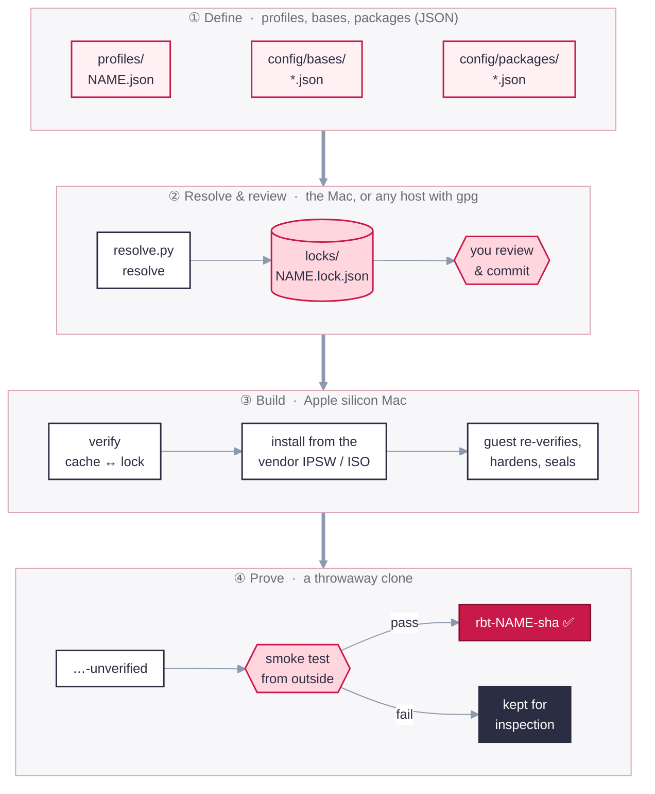

# How it works

Four stages turn a small JSON profile into a proven, named image: Define, Resolve, Build, Prove.

1. **Define.** A profile names an OS base and a list of tools. Bases and packages declare
   *where* each input comes from and *how* it is verified.
2. **Resolve.** `resolve.py` finds the current versions, downloads them, verifies them, and
   writes a lock. macOS profiles resolve on the Mac; NixOS and Kali resolve anywhere with `gpg`.
   **A human reviews the lock diff before it's committed.**
3. **Build.** `build.sh` re-checks the cache against the lock and installs from the vendor
   image. Inside the guest, every staged file is checked again before install. The guest then
   hardens itself, removes build residue and identity, and powers off.
4. **Prove.** A disposable clone boots and is attacked politely from outside. For a key-SSH image
   (`RHUBARB_SSH_PUBKEYS` set) password login must be refused and key login must work; an
   SSH-disabled image is instead proven to refuse connections on port 22. Either way, no
   auto-login, passwordless sudo or open Screen Sharing is allowed. Only then is the image renamed to `rbt-<profile>-<inputs-sha>`. The name
   is derived from the inputs, so identical inputs give an identical name, and
   `out/<vm>.provenance.json` records exactly what went in.

← back to the [README](../README.md)
