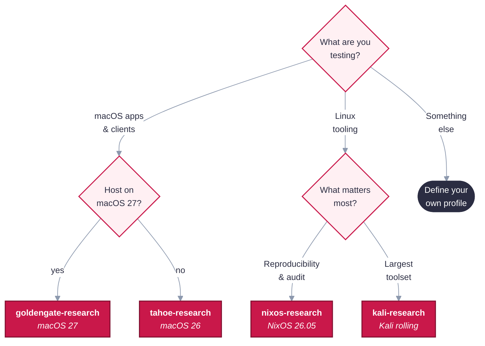

# Guests and profiles

A guest is defined by a small JSON profile in `profiles/`: an OS base, a list of tools and a few
options. The repository includes the profiles below; you can also write your own. Validation is
strict, so a typo can't silently build a different image.

## Choose a guest

| Profile | OS | Tools | Suited to |
|---|---|---|---|
| `tahoe-research` | macOS 26 | Chrome, ZAP, WARP, Tailscale | macOS app and client testing on any macOS 26 or newer host |
| `goldengate-research` | macOS 27 | Chrome, ZAP, WARP, Tailscale | The current macOS release; **needs a macOS 27 host** |
| `nixos-research` | NixOS 26.05 | Chrome, ZAP, WARP, Tailscale · XFCE · Rosetta | The most reproducible option: the whole OS is pinned to a single commit |
| `kali-research` | Kali rolling | Chrome, ZAP, WARP, Tailscale · `kali-linux-default` · XFCE · Rosetta | Kali's standard set of security tools |

All guests are arm64, because Tart runs native guests on Apple silicon. Linux profiles with
Rosetta enabled can still run x86_64 Linux programs. If none of these fit, you can
[define your own guest](#define-your-own-guest).

A fifth profile, `juiceshop-target`, is a lab target rather than a workstation: a NixOS guest that
runs OWASP Juice Shop on port 3000 with no route out. The `juiceshop-lab` engagement pairs it with
a Kali attacker ([Engagements](engagements.md)).

### Which one should I pick?



## Define your own guest

Copy a profile in `profiles/` and change it. This one is a lighter Kali for web testing:

```json
{
  "id": "kali-web",
  "description": "Kali for web-app testing",
  "base": "kali-rolling",
  "packages": ["chrome", "zap"],
  "username": "kaliweb",
  "vm": { "cpu": 6, "memory_gb": 12, "disk_gb": 100 },
  "options": { "desktop": "xfce", "rosetta": false, "kali_metapackages": ["kali-linux-headless"] }
}
```

<table>
<tr><th>Tool</th><th>macOS</th><th>NixOS</th><th>Kali</th></tr>
<tr><td><code>chrome</code></td><td>✅</td><td>✅</td><td>✅</td></tr>
<tr><td><code>zap</code></td><td>✅</td><td>✅</td><td>✅ (Kali archive)</td></tr>
<tr><td><code>warp</code></td><td>✅</td><td>✅</td><td>✅</td></tr>
<tr><td><code>tailscale</code></td><td>✅</td><td>✅</td><td>✅</td></tr>
<tr><td><code>juice-shop</code></td><td></td><td>✅ (lab target only)</td><td></td></tr>
</table>

`juice-shop` runs OWASP Juice Shop as a service on port 3000 with no outbound access. It belongs
in a target profile such as `juiceshop-target`, never on a machine you attack from.

| Key | Rule |
|---|---|
| `id` | Equals the filename; 2–41 characters: lowercase letters, digits and dashes, not starting with a dash |
| `description` | Optional free text, shown by `uv run tools/resolve.py list` |
| `base` | `macos-26`, `macos-27`, `nixos-26.05`, `kali-rolling` (files in `config/bases/`) |
| `packages` | Tools from the catalog above, each listed once; each must support the base's OS |
| `username` | 3–16 characters, lowercase letters and digits, starting with a letter (default `admin`). Kali rejects names its installer reserves, including `admin`, so a Kali profile must set one |
| `vm` | `cpu` 2–64, `memory_gb` 4–256, `disk_gb` 40–2048 (defaults come from the base) |
| `options.desktop` | NixOS/Kali: `"none"` or `"xfce"` |
| `options.rosetta` | NixOS/Kali: run x86_64 binaries (`rhubarbtart run` then starts clones with `--rosetta=rosetta`) |
| `options.kali_metapackages` | Kali: a list of Kali packages, for example `kali-linux-default` or `kali-linux-headless` |

Unknown keys, options for the wrong OS, bad values and unsupported tools are all rejected. Check with
`uv run tools/resolve.py list`. Editing a profile changes its identity, so re-resolve its lock.
Adding a tool that isn't in the catalog needs a trustworthy source first; see
[Keeping inputs fresh](reference.md#keeping-inputs-fresh).

> **Note:** A tool with no public download (for example a licensed agent from a vendor's admin console) can
> still be added to a macOS guest as a **local** package (`resolver: "local"`, a `.pkg` or `.dmg`):
> its installer goes in `vendor/<id>/`, where git ignores `.pkg`, `.dmg` and `.cer` files, and it is
> pinned by hash on first resolve. See [`vendor/README.md`](https://github.com/errantpacket/RhubarbTart/blob/main/vendor/README.md). An image containing one is
> tenant-specific, so share it only through a private registry.
