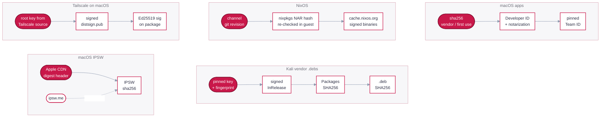
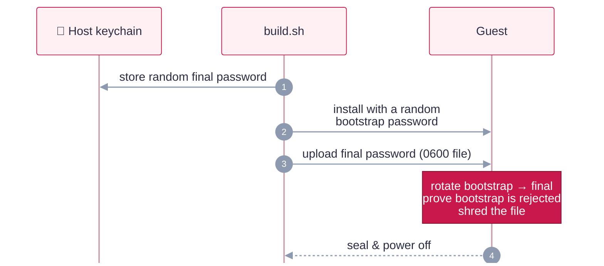

# Trust model and security posture

How trust is anchored for every kind of input, and the hardening each guest family asserts and proves.

## Trust model

Each kind of input has its own chain of trust. The lock records which chain produced every hash
(`hash_sources`), so reviewers can see where trust comes from.

<b>Full provenance table</b> (every input, its anchor and its signer)

| Input | Source | Hash anchor | Signature / signer |
|---|---|---|---|
| Host toolchain | Upstream releases | `config/toolchain.env` | See [Toolchain](reference.md#toolchain) |
| macOS IPSW | `updates.cdn-apple.com` only | Apple CDN `x-amz-meta-digest-sha256`, cross-checked with ipsw.me | Apple-signed components, enforced by the VM boot chain |
| NixOS ISO | `releases.nixos.org` (versioned) | Published `.sha256` over HTTPS | — (installer only) |
| nixpkgs (whole OS) | GitHub archive of the channel's `git-revision` | sha256 + **NAR hash** (pure-Python, matches Nix), re-verified by Nix in the guest | Binaries: `cache.nixos.org` signature (`require-sigs`) |
| Kali ISO | `cdimage.kali.org/kali-<ver>/` | `SHA256SUMS` | GPG, Kali key `827C 8569 … C8D5 E4C5` |
| Kali vendor `.deb`s | Google / Cloudflare / Tailscale apt repos | `Packages` SHA256 from the signed `InRelease` | GPG: Google `EB4C…4796`, Cloudflare `C068…C3BA`, Tailscale `2596…5868` |
| Kali distro packages | Kali archive | apt | Kali archive key; installed versions recorded in the image |
| NixOS packages | nixpkgs at the pinned rev | Fixed-output hashes in nixpkgs | nixpkgs maintainers + cache signature |
| Chrome (macOS) | Enterprise pkg (unversioned URL) | First use | Developer ID + notarized, Team `EQHXZ8M8AV` |
| ZAP (macOS) | GitHub release | GitHub asset digest | **Unsigned** (no Apple signature exists); integrity is the pinned digest, enforced on the host and again in-guest (`SHA256SUMS`) |
| WARP (macOS) | Versioned pkg from Cloudflare's feed | First use (no vendor hash exists) | Developer ID + notarized, Team `68WVV388M8` |
| Tailscale (macOS) | `pkgs.tailscale.com` | Vendor `.sha256` | **distsign** Ed25519 chain from a pinned root, plus Team `W5364U7YZB` |
| Perimeter 81 (macOS) | Your tenant portal | First use | Developer ID + notarized; pin the Team ID after the first resolve |
| Textual (TUI dep) | PyPI (`files.pythonhosted.org`) | `tools/rhubarb_tui.py.lock` (uv script lockfile; per-file sha256) | — (pinned + hash-verified by uv; the repo's only *directly-declared* third-party Python dep — uv hash-verifies its transitive deps too) |

**What "pinned" means per family.** NixOS is the strongest: one commit plus a NAR hash defines
the whole OS. macOS and Kali pin the OS image and every vendor tool. Kali is a rolling release,
though, so packages from the Kali archive (such as `zaproxy` and the metapackages) are "signed
and current at build time", and their exact versions are recorded in
`/var/lib/rhubarbtart/installed.txt`. "Reproducible" means identical inputs and process, not
identical disk bytes; machine identifiers and timestamps always differ.

Most macOS tools are Developer ID-signed and notarized with a pinned Team ID. The one exception is
ZAP, which ships no Apple signature: it's marked `"signed": false` and verified solely by its
pinned GitHub-release digest (host **and** in-guest) — a weaker tier, called out in the table
above. A `"signed": false` tool must always carry a real pinned hash, or resolve refuses it.

## Security posture

| | macOS | NixOS | Kali |
|---|---|---|---|
| **Password** | Random per build, host keychain only | same | same |
| **How it gets there** | Typed over VNC (26); bootstrap → rotate → proven dead (27) | yescrypt hash from a 0600 upload, outside the Nix store | Bootstrap → `chpasswd` from stdin |
| **Login** | No auto-login | No auto-login | No auto-login |
| **sudo** | Password required; no `NOPASSWD` | Password required; `execWheelOnly` | Password required; `kali-grant-root` purged and pinned out. One scoped exception: OpenVAS's locked, nologin `_gvm` may run `/usr/sbin/openvas` (#59) |
| **SSH** | Key-only, `from=` host, no forwarding; off without keys | same, declared in Nix | same |
| **Identity** | Host keys wiped, regenerated per clone | Never generated in the image | Host keys + machine-id wiped, regenerated per clone |
| **Firewall** | Application firewall + stealth | NixOS firewall | nftables inbound default-deny |
| **Integrity** | SIP + Gatekeeper on | Signed binary cache only | Signed Kali archive only |
| **VPN identity** | Wiped; enrolled per clone | Not created; enrolled per clone | Stopped + wiped; enrolled per clone |

Every row is asserted during the build's seal step (or declared in `nix/`), and every observable
row is re-checked from outside by `scripts/smoke-test.sh`.

Where a tool forces a password onto a command line (Apple's provisioning API, the Kali
installer), RhubarbTart uses a throwaway **bootstrap** password and rotates it away:

← back to the [README](../README.md)
