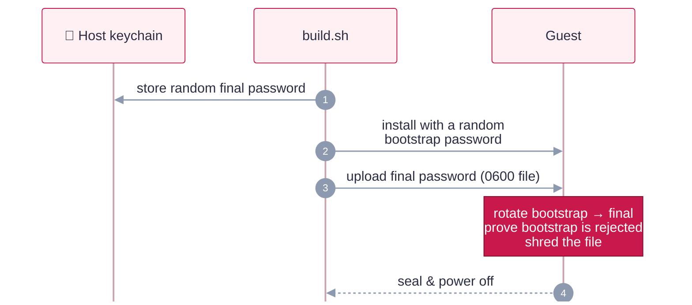

# Trust model and security posture

How trust is anchored for every kind of input, where the host draws its boundaries at runtime, and
the hardening each guest family asserts and proves.

## Trust model

Each kind of input has its own chain of trust. The lock records which chain produced every hash
(`hash_sources`), so reviewers can see where trust comes from.

<b>Full provenance table</b> (every input, its anchor and its signer)

| Input | Source | Hash anchor | Signature / signer |
|---|---|---|---|
| Host toolchain | Upstream releases | `config/toolchain.env` | See [Toolchain](reference.md#toolchain) |
| macOS IPSW | `updates.cdn-apple.com` only | Apple CDN `x-amz-meta-digest-sha256`, cross-checked with ipsw.me | Apple-signed components, enforced by the VM boot chain |
| NixOS ISO | `releases.nixos.org` (versioned) | Published `.sha256` over HTTPS | None (installer only) |
| nixpkgs (whole OS) | GitHub archive of the channel's `git-revision` | sha256 + **NAR hash** (pure-Python, matches Nix), re-verified by Nix in the guest | Binaries: `cache.nixos.org` signature (`require-sigs`) |
| Kali ISO | `cdimage.kali.org/kali-<ver>/` | `SHA256SUMS` | GPG, Kali key `827C 8569 … C8D5 E4C5` |
| Kali vendor `.deb`s | Google / Cloudflare / Tailscale apt repos | `Packages` SHA256 from the signed `InRelease` | GPG: Google `EB4C…4796`, Cloudflare `C068…C3BA`, Tailscale `2596…5868` |
| Kali distro packages | Kali archive | apt | Kali archive key; installed versions recorded in the image |
| NixOS packages | nixpkgs at the pinned rev | Fixed-output hashes in nixpkgs | nixpkgs maintainers + cache signature |
| Chrome (macOS) | Enterprise pkg (unversioned URL) | First use | Developer ID + notarized, Team `EQHXZ8M8AV` |
| ZAP (macOS) | GitHub release | GitHub asset digest | **Unsigned** (no Apple signature exists); integrity is the pinned digest, enforced on the host and again in-guest (`SHA256SUMS`) |
| WARP (macOS) | Versioned pkg from Cloudflare's feed | First use (no vendor hash exists) | Developer ID + notarized, Team `68WVV388M8` |
| Tailscale (macOS) | `pkgs.tailscale.com` | Vendor `.sha256` | **distsign** Ed25519 chain from a pinned root, plus Team `W5364U7YZB` |
| Textual (TUI dep) | PyPI (`files.pythonhosted.org`) | `tools/rhubarb_tui.py.lock` (uv script lockfile; per-file sha256) | None. Pinned to an exact version and hash-verified by uv, which also hash-verifies its transitive deps. The repo's only directly declared third-party Python dependency |

**What "pinned" means per family.** NixOS is the strongest: one commit plus a NAR hash defines
the whole OS. macOS and Kali pin the OS image and every vendor tool. Kali is a rolling release,
though, so packages from the Kali archive (such as `zaproxy` and the metapackages) are "signed
and current at build time", and their exact versions are recorded in
`/var/lib/rhubarbtart/installed.txt`. "Reproducible" means identical inputs and process, not
identical disk bytes; machine identifiers and timestamps always differ.

Most macOS tools are Developer ID-signed and notarized with a pinned Team ID. The one exception is
ZAP, which ships no Apple signature: it's marked `"signed": false` and verified only by its
pinned GitHub-release digest, on the host and again in the guest. That is a weaker tier, and the
table above calls it out. A `"signed": false` tool must always carry a real pinned hash, or resolve refuses it.

**Published images (optional, #32).** `scripts/publish.sh` pushes a smoke-passed image to an OCI
registry (by default a localhost-only `zot` from the pinned toolchain), then signs it and attests its
provenance record with the publisher's cosign key. Signing is deliberately **offline**: the key and
passphrase stay in the keychain and reach cosign only via its environment. The committed signing
config (`config/cosign/signing-config-offline.json`) names no CA, OIDC, transparency-log or
timestamp service, and every other host is routed to a dead proxy so cosign can reach only the registry, so nothing about these images reaches public Sigstore services. The
trade-off is that there's no public transparency log, so trust rests on the committed public key
`config/keys/rhubarb-cosign.pub`. Consumers verify with `publish.sh verify <ref@digest>` and
always use images by digest. `rhubarbtart new --from-registry` (macOS) runs that same verification before it
stacks a clone on the published copy, and refuses to clone anything that fails it.

## Host-side boundaries

Once clones run, the host holds the record and the controls. The guest is the thing under test,
so it never holds either.

- **Network.** Clones use Tart's default NAT network, which drops traffic between VMs, so clones
  can't reach each other. Guest SSH accepts only keys, and only from `192.168.64.1` (the `from=`
  restriction). An engagement's `links` are the only path between clones: `rhubarbtart engagement
  connect` opens an SSH remote forward (`ssh -R`) for each declared port, and the path closes when
  `connect` exits. Softnet was evaluated and rejected
  ([#30](https://github.com/errantpacket/RhubarbTart/issues/30)).
- **Evidence journal.** Each engagement's evidence lives in the host state dir as
  `evidence/<id>/journal.jsonl` plus content-addressed `items/<sha256>`, in 0700 directories and
  0600 files. Each entry commits to the previous entry and to its own content, so an edit,
  reordering or deletion fails `rhubarbtart evidence verify`. Commands run in an engagement's clones
  through `rhubarbtart exec` or the control plane are journaled as they run. Files are pulled from the clone and hashed on arrival,
  never extracted onto the host. On its own, the chain proves internal consistency, not origin.
- **Vaults.** `rhubarbtart vault seal` writes a read-only bundle whose `root.json` commits to the
  journal hash, every item hash and the chain head. `scripts/vault.sh` signs `root.json` with
  `cosign sign-blob --bundle`, using the same offline key and signing config as published images.
  `vault verify` checks the signature, then re-derives every hash. By default it uses the
  `cosign.pub` inside the bundle, which proves the bundle is intact. To prove who sealed it, pass
  the publisher's key with `--pub`.
- **Control-plane socket.** `rhubarbtart serve` listens on a Unix socket (`service.sock` in the state
  dir) created 0600 inside a 0700 operator-owned directory. There is no TCP listener and no token:
  filesystem permissions are the boundary. GET routes only read. Each POST route is one core call
  that journals its own evidence. The service never calls `tart` or the keychain itself, and
  `check.sh` enforces that.
- **Agents (herdr).** `rhubarbtart herdr arm` starts each agent in a herdr pane pinned to one clone
  (`RBT_RANGE_CLONE`) and the socket. The agent's tool is `rbt-range`, which runs commands in that
  clone through the socket, so every command is journaled and the agent never holds the clone's
  password. Commands that match a tiered pattern in `engagements/<id>.herdr.json` are held
  (exit 126, `approval_required`) until the operator runs `rhubarbtart herdr approve`. Each grant is
  single-use, and request, grant and use are all recorded in the evidence journal. This is the
  sanctioned, recorded path, not a sandbox: an agent runs as the operator on the host, so one that
  escapes its shell could reach the socket directly. See the
  [herdr charter](HERDR-CHARTER.md) for the stronger per-engagement driver VM model.

## Security posture

| | macOS | NixOS | Kali |
|---|---|---|---|
| **Password** | Random per build, host keychain only | same | same |
| **How it gets there** | Typed over VNC (26); bootstrap → rotate → proven dead (27) | yescrypt hash from a 0600 upload, outside the Nix store | Bootstrap → `chpasswd` from stdin |
| **Login** | No auto-login | No auto-login | No auto-login |
| **sudo** | Password required; no `NOPASSWD` | Password required; `execWheelOnly` | Password required; `kali-grant-root` purged and pinned out. One scoped exception: OpenVAS's locked, nologin `_gvm` may run `/usr/sbin/openvas` (#59) |
| **SSH** | Key-only, `from=` host, no forwarding; off without keys | same, declared in Nix | same |
| **Identity** | Host keys wiped, regenerated per clone | Never generated in the image | Host keys + machine-id wiped, regenerated per clone |
| **Firewall** | Application firewall + stealth | NixOS firewall | nftables inbound default-deny |
| **Integrity** | SIP + Gatekeeper on | Signed binary cache only | Signed Kali archive only |
| **VPN identity** | Wiped; enrolled per clone | Not created; enrolled per clone | Stopped + wiped; enrolled per clone |

Every row is asserted during the build's seal step (or declared in `guest/nixos/nix/`), and every observable
row is re-checked from outside by `scripts/smoke-test.sh`. For Linux images the smoke test also
reboots its clone once and checks, on both boots, that `/` is read-write and the fstab mounts
came up (#98).

Where a tool forces a password onto a command line (Apple's provisioning API, the Kali
installer), RhubarbTart uses a throwaway **bootstrap** password and rotates it away:

← back to the [README](../README.md)
