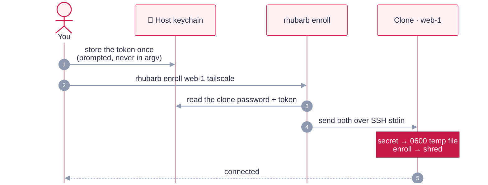

# Using your VMs

Built images are templates: you work in disposable **clones** of them (see
[Key concepts](concepts.md#what-you-work-in)). Clones are managed by the `rhubarb` CLI, or by the
`./rhubarb-tui` Textual dashboard, which drives the same actions over the same audited core:
browse images, clones and provenance; run, ssh, enroll, reset, rm, new and build, with a
confirmation before anything destructive. For stacked macOS clones from a registry, see
[Publishing and stacked clones](publishing.md).

```sh
./rhubarb images                              # built images; which one is current per profile
./rhubarb new web-1 --profile kali-research   # clone the current image; give it its OWN password
./rhubarb new mac-1 --profile tahoe-research --from-registry   # macOS: stack on the verified registry copy
./rhubarb run web-1                           # GUI (Rosetta applied if the profile uses it)
./rhubarb ssh web-1                           # key-only SSH, host key pinned per clone
./rhubarb enroll web-1 tailscale              # VPN identity for this clone only
./rhubarb list                                # clones: state, outdated image?, password, enrollment
./rhubarb reset web-1                         # destroy + fresh clone of the current image
./rhubarb rm web-1                            # delete the clone (+ keychain entry if it had a unique password)
```

| Command | What it does |
|---|---|
| `new NAME --profile P` / `--image IMG` | Clones a **verified** image (never `-unverified`), records its lineage, then boots it headless and rotates it to a **unique random password** (keychain account = clone name), proving through `sudo` that the old one is rejected. `--no-rotate` keeps the image's password. `--from-registry` (macOS only, #31): verify the image's published copy by digest (signature + provenance, `scripts/publish.sh`) and stack the clone on it (`tart clone --stacked`, tens of MB instead of a full copy). `list` shows `base-missing` if the pulled base is gone, and `rm` releases the base when no other clone uses it |
| `run NAME [--headless] [--detach]` | Starts the clone with the right flags for its profile (`--rosetta=rosetta` for Linux Rosetta profiles) |
| `stop NAME` | Stops a running clone (the VM and its records stay) |
| `ssh NAME [-- CMD]` | Connects as the profile's user, host key pinned per clone name |
| `enroll NAME tailscale\|warp [--org TEAM]` | Runtime VPN/ZTNA enrollment (see below) |
| `list` · `images` | Flags clones whose image is **outdated** (the profile's lock changed) or **deleted**, and shows each clone's password mode and enrollments |
| `reset NAME [--same-image]` | Throws the clone away (identity, enrollment and all) and re-clones, from the current image by default |
| `rm NAME [--yes]` | Stops and deletes the clone, its keychain entry (only if it had a unique/rotated password) and its pinned host key |

> [!NOTE]
> `rhubarb` only touches clones it created. It never modifies built images (`rbt-…`) or VMs
> made some other way, and clone names can't start with `rbt-`. Per-clone rotation needs key
> SSH (images built with `RHUBARB_SSH_PUBKEYS`, with the key in `ssh-agent` or `RHUBARB_SSH_IDENTITY`
> pointing at it). Without it the clone keeps the image's password, and `rhubarb list` says
> `inherited` — an image built with SSH disabled is refused up front with a rebuild hint.

### Engagements

An **engagement** is a committed scope manifest (`engagements/<id>.json`) naming a set of ranges
(profile + count) that build and tear down as one unit; clones it provisions are tagged with the
engagement id.

| Command | What it does |
|---|---|
| `engagement define FILE\|ID` | Validate a manifest and acknowledge it (strict: unknown keys, bad ranges or a missing `authorization` are rejected) |
| `engagement list` | Defined engagements and their live clone counts |
| `engagement provision ID` | Clone each range from its **verified** image into engagement-tagged clones |
| `engagement connect ID` | Open the manifest's `links` and hold them until Ctrl-C (both clones must be running) |
| `engagement teardown ID [--yes] [--no-collect]` | Collect evidence from running clones, then remove exactly the clones tagged to that engagement (nothing else) |
| `exec NAME -- CMD` | Run a command in a clone; for an engagement clone, the command and its output are recorded as evidence |
| `evidence collect\|list\|verify ID` | Pull each clone's `~/evidence` folder; show the journal; recompute the hash chain |

**Evidence.** Each engagement keeps a record on your Mac, under
`~/Library/Application Support/RhubarbTart/evidence/<id>/`, never in the clones:

- **Commands.** `rhubarb exec` (and agents, through the same API) records the command, user,
  exit code, times and full output of each command run in an engagement clone. Interactive
  `rhubarb ssh` sessions are not recorded.
- **Files.** Anything a clone puts in its user's `~/evidence/` folder (scan output, notes,
  findings) is pulled by `evidence collect` and hashed as it arrives. The folder comes over as a
  tar stream that is read, never unpacked, so symlinks and paths outside the folder are refused.
  Unchanged files aren't recorded twice. `teardown` collects first, because a clone's files die
  with it; a clone that is stopped at that point can't be collected.
- **Ground truth.** A package can declare an endpoint that says what really happened. For Juice
  Shop, `collect` saves `/api/Challenges/`, which lists the challenges actually solved, to check
  claimed findings against.
- **Lifecycle.** Provision (with the image each clone came from), connect and disconnect,
  collect and teardown are recorded too.

Every entry is one line of `journal.jsonl` and includes the hash of the entry before it, and
outputs and files are stored by their sha256. `evidence verify` recomputes all of it and reports
an edited, reordered or deleted entry or an altered file. The journal is not signed or encrypted
yet; that is the vault ([#86](https://github.com/errantpacket/RhubarbTart/issues/86)).

**Networking between clones.** Clones can't reach each other: Tart's default network drops
traffic between VMs. A manifest's `links` are the only path, and they go through your Mac:

```json
"links": [ { "from": "jsl-attacker", "to": "jsl-target", "ports": [3000] } ]
```

`from` and `to` name ranges by their clone-name stem (the `prefix`, or `<engagement>-<profile>`).
`to` must be a range of one clone, and each port must be one its profile declares (a package's
`"ports"`). `connect` opens an SSH remote forward into every `from` clone, so the target's port
shows up on that clone's own loopback: in the Juice Shop lab, Kali browses
`http://127.0.0.1:3000`. Nothing else crosses, and the path closes with `connect`.

A lab target also has no egress of its own. The Juice Shop service may only talk to loopback and
the Mac (systemd `IPAddressDeny=any`), and a firewall rule rejects any new outbound connection it
makes, so an exploited app can't reach your LAN, the internet, or services on your Mac. The build
asserts both, and the smoke test checks the service's filter.

<details>
<summary><b>Why not Softnet?</b></summary>

Tart's `--net-softnet` gives each VM its own network and an egress policy, but in September 2026
its release binary is unsigned and not notarized, it must run as root (SUID or passwordless
sudo), and it moves each VM onto a random subnet, which breaks the images' pinned SSH source
address. The evaluation is in [#30](https://github.com/errantpacket/RhubarbTart/issues/30). When
Tart ships its native host-only network (no root helper), lab targets can move onto it.

</details>

<details>
<summary><b>Where clone records live, and why</b></summary>

Records are kept in `~/Library/Application Support/RhubarbTart/` (override with
`RHUBARB_STATE_DIR`):

- **Outside the repo**, so they're never committed or synced with it, and **outside Tart's VM
  folders**, so they never ship inside a VM bundle or registry push.
- **No secrets:** they hold only names, lineage, username and timestamps. Passwords stay in the
  macOS keychain.
- **Like OpenSSH's StrictModes,** a record is trusted only if the folder is `0700` and the file
  is `0600`, owned by you, and a regular file (not a symlink). Its schema is strict and its name
  must match the file, so a planted or corrupted record can't steer the CLI at the wrong VM or
  keychain entry. Writes are atomic.
- **`events.log`** keeps an append-only trail (no secrets) of `new`, `rotate`, `enroll`,
  `reset` and `rm`.
- **They're not a boundary against malware running as you,** which could drive `tart` and your
  keychain directly anyway. They're about correctness and least surprise.

</details>

### VPN and ZTNA enrollment

Images never contain VPN identity. Each clone is enrolled at runtime, and the secrets never
touch the repo, a profile, the image, or a command line:



| Service | Command | Secret (keychain service `RhubarbTart-enroll`) | Notes |
|---|---|---|---|
| Tailscale | `rhubarb enroll web-1 tailscale` | account `tailscale-authkey` | Use a one-off, pre-approved, *tagged* key (ephemeral for throwaway clones). macOS: approve the system extension once per clone |
| Cloudflare WARP | `rhubarb enroll web-1 warp --org TEAM` | `warp-client-id`, `warp-client-secret` | A service token allowed to enroll devices; dashboard version pushes are disabled |

Store a secret once with `security add-generic-password -s RhubarbTart-enroll -a tailscale-authkey -w`
(it prompts, so the secret never lands in your shell history). `rhubarb enroll` wraps
`scripts/enroll.sh` and records which services each clone is enrolled in.

← back to the [README](../README.md)
