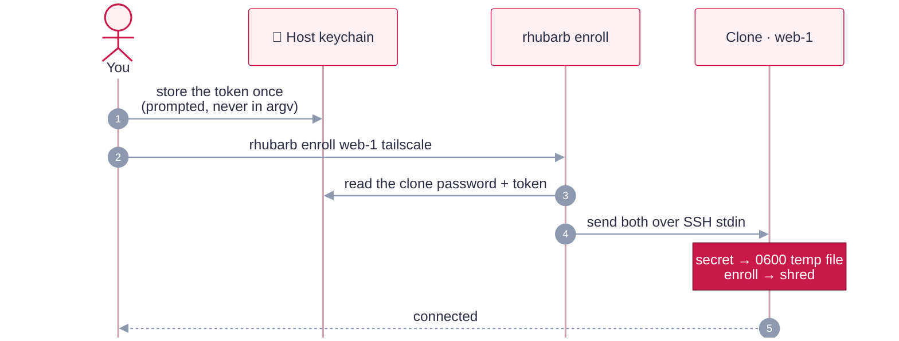

# Using your VMs

You work in disposable clones of a built image, driven by the `rhubarb` CLI — or the `./rhubarb-tui` Textual dashboard, which drives the same actions over the same audited core.

Built images are templates: you work in **clones**, managed by the `rhubarb` CLI — or the
`./rhubarb-tui` Textual dashboard, which drives the same actions over the same audited core
(browse images/clones/provenance; run, ssh, enroll, reset, rm, new and build, with confirms on
destructive ones).

```sh
./rhubarb images                              # built images; which one is current per profile
./rhubarb new web-1 --profile kali-research   # clone the current image; give it its OWN password
./rhubarb run web-1                           # GUI (Rosetta applied if the profile uses it)
./rhubarb ssh web-1                           # key-only SSH, host key pinned per clone
./rhubarb enroll web-1 tailscale              # VPN identity for this clone only
./rhubarb list                                # clones: state, outdated image?, password, enrollment
./rhubarb reset web-1                         # destroy + fresh clone of the current image
./rhubarb rm web-1                            # delete the clone and its keychain entry
```

| Command | What it does |
|---|---|
| `new NAME --profile P` / `--image IMG` | Clones a **verified** image (never `-unverified`), records its lineage, then boots it headless and rotates it to a **unique random password** (keychain account = clone name), proving through `sudo` that the old one is rejected. `--no-rotate` keeps the image's password |
| `run NAME [--headless] [--detach]` | Starts the clone with the right flags for its profile (`--rosetta=rosetta` for Linux Rosetta profiles) |
| `ssh NAME [-- CMD]` | Connects as the profile's user, host key pinned per clone name |
| `enroll NAME tailscale\|warp\|perimeter81 [--org TEAM]` | Runtime VPN/ZTNA enrollment (see below) |
| `list` · `images` | Flags clones whose image is **outdated** (the profile's lock changed) or **deleted**, and shows each clone's password mode and enrollments |
| `reset NAME [--same-image]` | Throws the clone away (identity, enrollment and all) and re-clones, from the current image by default |
| `rm NAME [--yes]` | Stops and deletes the clone, its keychain entry and its pinned host key |

> [!NOTE]
> `rhubarb` only touches clones it created. It never modifies built images (`rbt-…`) or VMs
> made some other way, and clone names can't start with `rbt-`. Per-clone rotation needs key
> SSH (images built with `RHUBARB_SSH_PUBKEYS`, with the key in `ssh-agent` or `RHUBARB_SSH_IDENTITY`
> pointing at it). Without it the clone keeps the image's password, and `rhubarb list` says
> `inherited` — an image built with SSH disabled is refused up front with a rebuild hint.

<details>
<summary><b>Where clone records live, and why</b></summary>

Records are kept in `~/Library/Application Support/RhubarbTart/` (override with
`RHUBARB_STATE_DIR`):

- **Outside the repo**, so they're never committed or synced with it, and **outside Tart's VM
  folders**, so they never ship inside a VM bundle or registry push.
- **No secrets:** they hold only names, lineage, username and timestamps. Passwords stay in the
  macOS keychain.
- **Like OpenSSH's StrictModes,** a record is trusted only if the folder is `0700` and the file
  is `0600`, owned by you, and a regular file (not a symlink). Its schema is strict and its name
  must match the file, so a planted or corrupted record can't steer the CLI at the wrong VM or
  keychain entry. Writes are atomic.
- **`events.log`** keeps an append-only trail (no secrets) of `new`, `rotate`, `enroll`,
  `reset` and `rm`.
- **They're not a boundary against malware running as you,** which could drive `tart` and your
  keychain directly anyway. They're about correctness and least surprise.

</details>

### VPN and ZTNA enrollment

Images never contain VPN identity. Each clone is enrolled at runtime, and the secrets never
touch the repo, a profile, the image, or a command line:



| Service | Command | Secret (keychain service `RhubarbTart-enroll`) | Notes |
|---|---|---|---|
| Tailscale | `rhubarb enroll web-1 tailscale` | account `tailscale-authkey` | Use a one-off, pre-approved, *tagged* key (ephemeral for throwaway clones). macOS: approve the system extension once per clone |
| Cloudflare WARP | `rhubarb enroll web-1 warp --org TEAM` | `warp-client-id`, `warp-client-secret` | A service token allowed to enroll devices; dashboard version pushes are disabled |
| Perimeter 81 | `rhubarb enroll web-1 perimeter81` | — | Prints the manual sign-in and extension-approval steps |

Store a secret once with `security add-generic-password -s RhubarbTart-enroll -a tailscale-authkey -w`
(it prompts, so the secret never lands in your shell history). `rhubarb enroll` wraps
`scripts/enroll.sh` and records which services each clone is enrolled in.

← back to the [README](../README.md)
